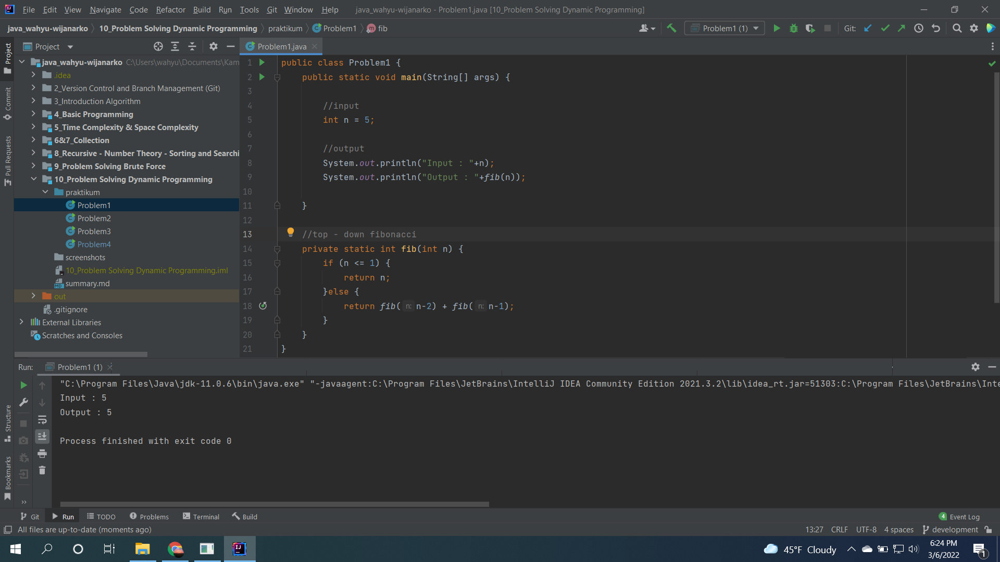
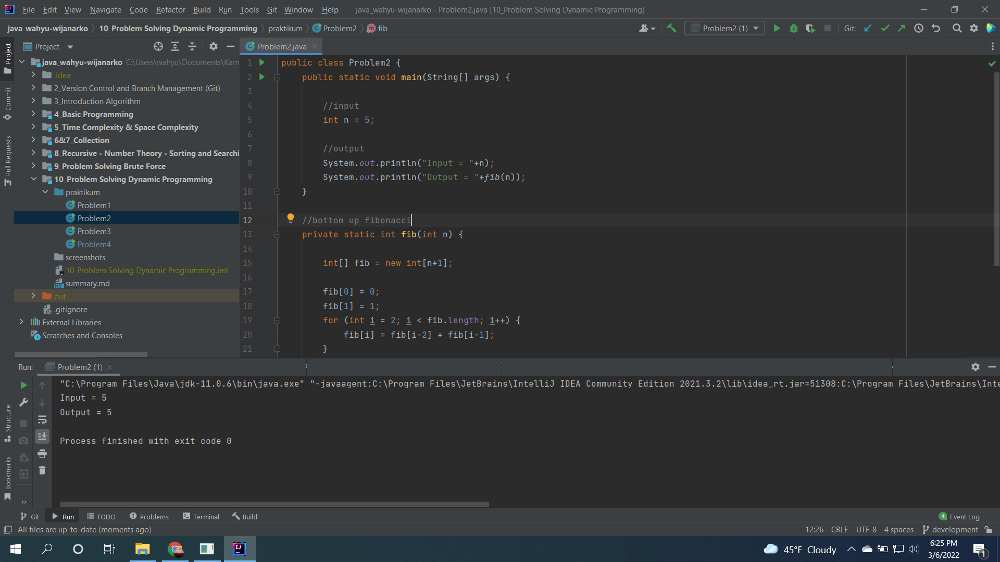
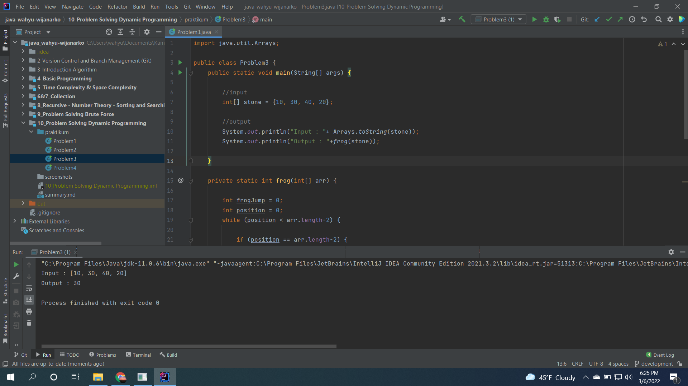
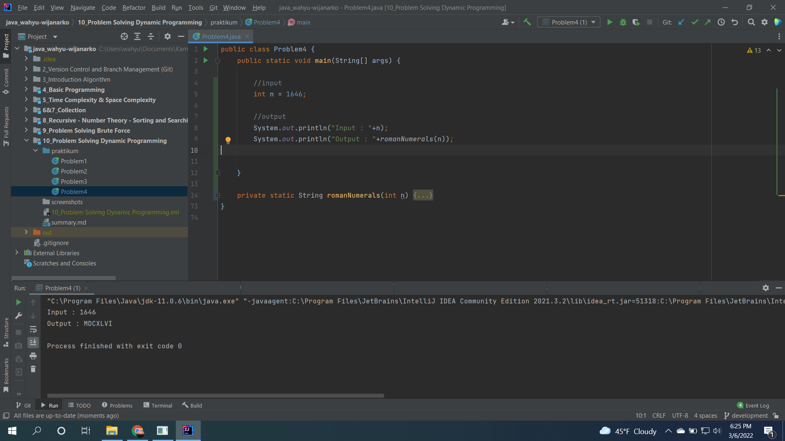

# (10) Problem Solving Dynamic Programming
## Resume
Materi pada section ini meliputi:
1. Dynamic Programming
2. Dynamic Programming Characteristic
3. Dynamic Programming Method

#### Dynamic Programming
adalah teknik algoritma untuk optimasi penyelesaian masalah dengan memecah menjadi sub-masalah(masalah yang lebih kecil).

#### Karakteristik Dynamic Programming
##### 1. Overlapping Problem
Sub-masalah adalah bagian kecil dari masalah utama. Memecahkan masalah utama dengan menyelesaikan sub-masalah berkali-kali.

##### 2. Optimal Substructure Property
Setiap masalah memiliki properti substruktur optimal jika keseluruhan solusi optimal bisa dibangun dari solusi optimal submasalah.

#### Metode Dynamic Programming
##### 1. Top-Down with Memoization
Pendekatan ini mencoba menyelesaikan masalah yang lebih besar dengan pengulangan penyelesaian masalah yang lebih kecil.

##### 2. Bottom-Up with Tabulation
Kebalikan dari Top-Down dan menghindari pengulangan.

## Task
#### 1. Fibonacci Number (Top-Down)
Membuat fungsi yang menghasilkan bilangan fibonacci dengan pendekatan Top-Down.  
Code :  
[Problem1.java](./praktikum/Problem1.java)
  
Screenshot :  

#### 2. Fibonacci Number (Bottom-Up)
Membuat fungsi yang menghasilkan bilangan fibonacci dengan pendekatan Bottom-Up.
Code :  
[Problem2.java](./praktikum/Problem2.java)
  
Screenshot :  

#### 3. Frog
Membuat fungsi yang dapat menghitung total harga lompatan katak terendah.  
Code :  
[Problem3.java](./praktikum/Problem3.java)
  
Screenshot :  

#### 4. Roman Numeral
Membuat fungsi yang dapat mengubah bilangan integer menjadi bilangan romawi.  
Code :  
[Problem4.java](./praktikum/Problem4.java)

Screenshot :  
