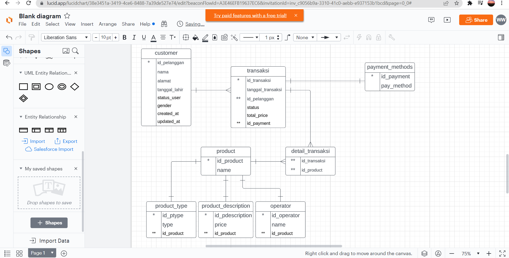

# (13) Database Schema - DDL - DML Join - Union - Agregasi - Subquery - Function (DBMS)
## Summary
Pembelajaran pada materi ini meliputi:  
1. Database
2. Database relationship
3. DDL

#### Database
adalah kumpulan data.

#### Database Relationship
1. One to One : Satu entitas berelasi dengan satu entitas lainnya.
2. One to Many : satu entitas berelasi dengan banyan entitas.
3. Many to Many : relasinya dengan banyak entitas.

#### DDL
adalah Data Definition Language.

## Task
#### 1. Membuat schema database
Screenshot :  
  
#### 2. Implementasi schema database
Mengimplementasikan schema database yang telah dibuat dan dengan penambahan beberapa entitas baru.  
Screenshot hasil :  
.png)