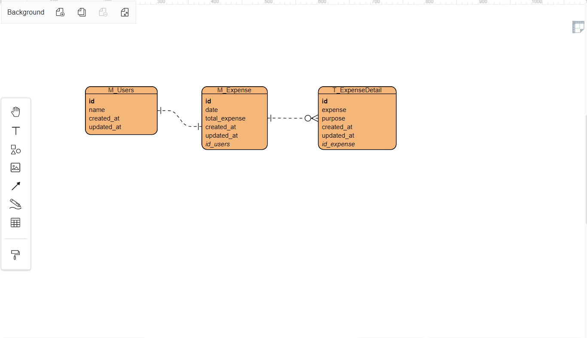

# (18) System Design
## Summary
Pembelajaran pada materi ini meliputi:
1. Diagram
2. Karakteristik
3. Monolithic and Microservices
4. Caching

#### Diagram
Teknik visualisasi untuk merepresentasikan informasi.  
Contoh - contoh diagram yang dipakai pada desain sistem yaitu:
- FlowChart
- Use Case Diagram
- Entity Relational Diagram

##### Use Case Diagram
Use case diagram meringkas semua aktivitas pengguna dalam sebuah sistem.

#### Karakteristik pada desain sistem.
- Scalability, kemampuan sistem untuk berkembang.
- Reliability, kemungkinan sebuah sistem dapat gagal dalam jangka waktu tertentu.
- Availability, sistem dapat beroperasi dalam jangka waktu yang diberikan.
- Efficiency
- Serviceability & Manageability, sistem dapat diperbaiki dan dimaintenance.

#### Monolithic
Memiliki kode basis tunggal dengan module beragam.

#### Microservices
Layanan yang terdistribusi secara independen.

#### Caching
Cache dipakai ketika ada data yang kemungkinan akan diminta terus - menerus secara berulang.
Sering terjadi pada bagian Front-End.

## Task
Studi kasus: pencatatan pengeluaran harian.
1. Membuat ERD
    Screenshot Entity Relational Diagram:  
      
  
2. Membuat Use Case Diagram:
    Screenshot:  
    