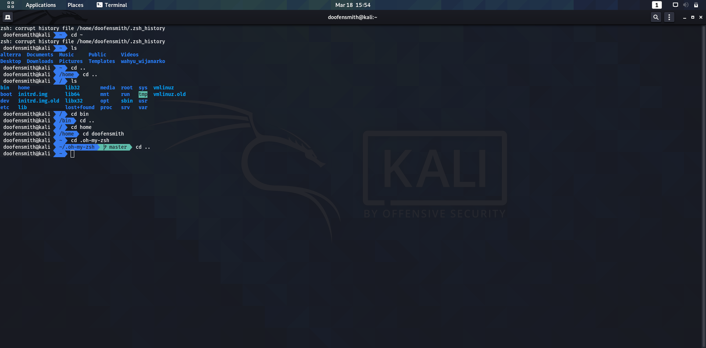

# (19) Configuration Management and CLI
## Summary
Materi pada pembelajaran ini meliputi:
1. CLI
2. Advantages of Using CLI
3. Example of CLI
4. UNIX Shell

#### Command Line Interface
Command Line adalah tampilan berbasis teks yang cepat dan powerful yang digunakan developer untuk berkomunikasi dengan komputer untuk menyelesaikan tugas dengan lebih cepat dan efisien.

#### Advantages
- Butiran kontrol dari OS dan aplikasi.
- Management lebih cepat.
- Kemampuan untuk menyimpan script dan melakukan automasi perintah.
- Membantu penyelesaian masalah.

#### Example of CLI
1. CLI for OS:
    - UNIX Shell
    - Command Prompt
2. App CLI:
    - Python
    - Mongo shell
    - MySQL CLI Client

#### UNIX Shell
Contoh command unix yang sering digunakan:
1. Untuk kebutuhan manipulasi direktori:
    - psw
    - ls
    - mkdir
    - rm
    - cd
    - mv
    - cp
2. Untuk kebutuhan manipulasi file:
    - Membuat file : touch
    - Melihat isi file : head, cat, tail, less
    - Editor : vim, nano
    - Permission : chmod
3. Untuk kebutuhan networking:
    - nmap
    - ping
    - ssh
    - curl
    - wget
    - netcat
    - netstat
4. Untuk kegunaan lain:
    - Menampilkan atau menyimpan sesuatu : echo
    - Tanggal saat ini : date
    - Perintah admin : sudo

## Task
#### 1. Instalasi ZSH Shell
Screenshot perubahan pada shell setelah berhasil install:  

#### 2. Membuat automation script
Screenshot script yang dibuat:  
  

Screenshot directory tree setelah berhasil menjalankan script:  

