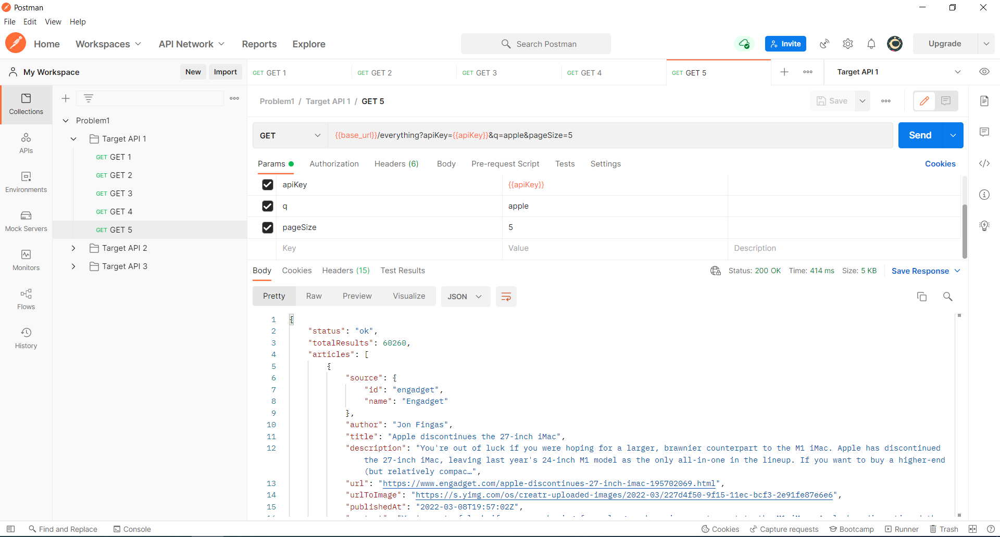
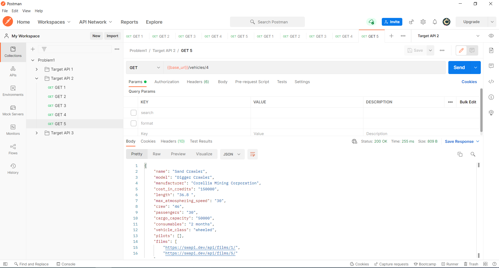
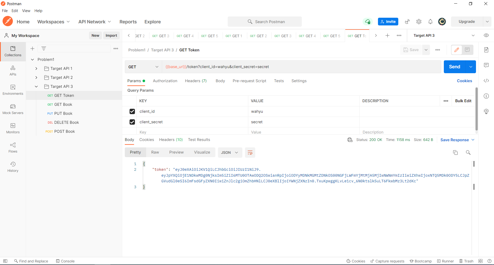
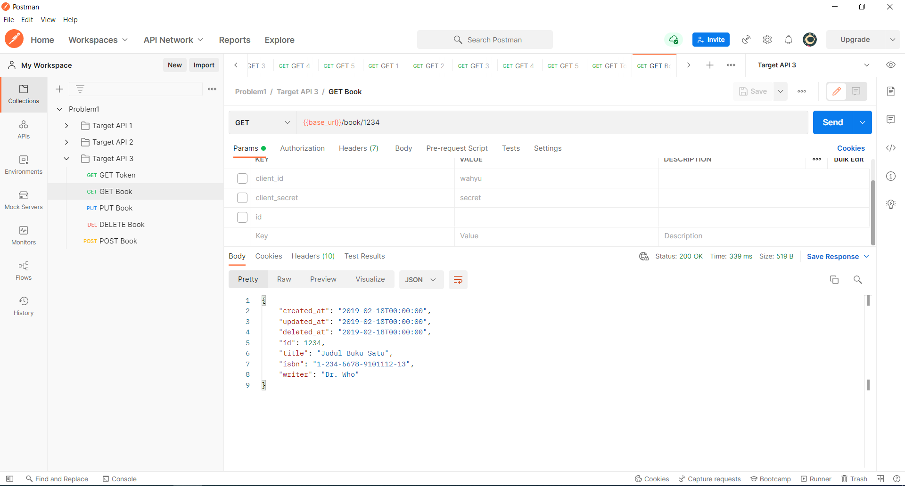
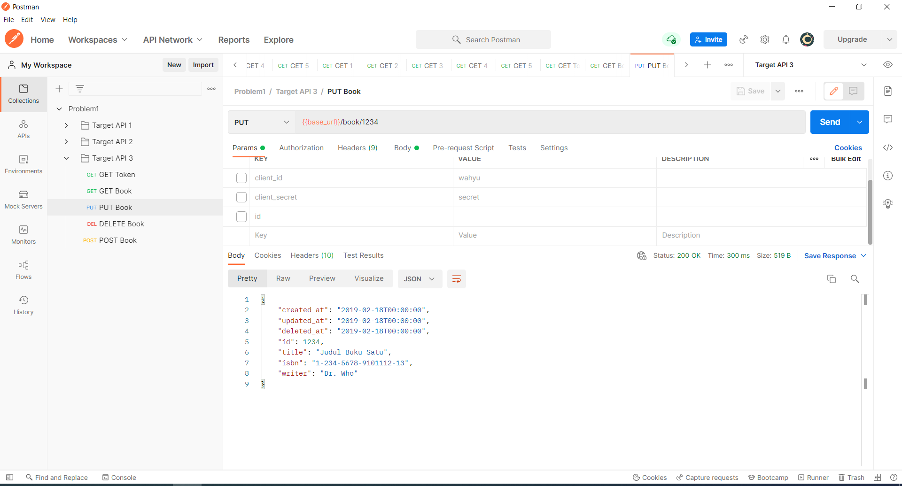
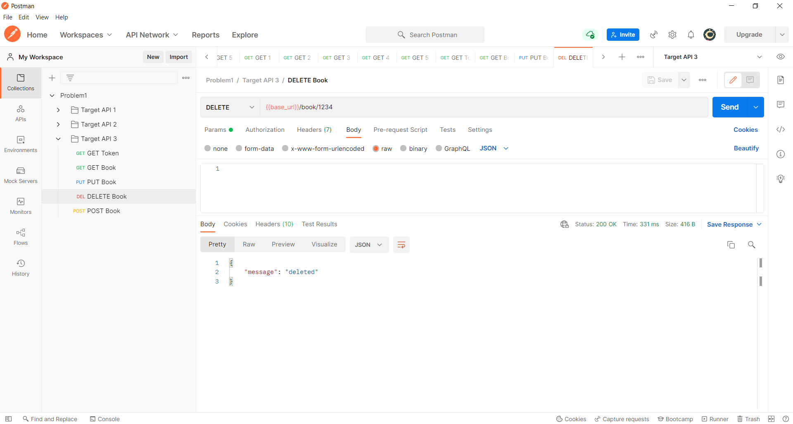
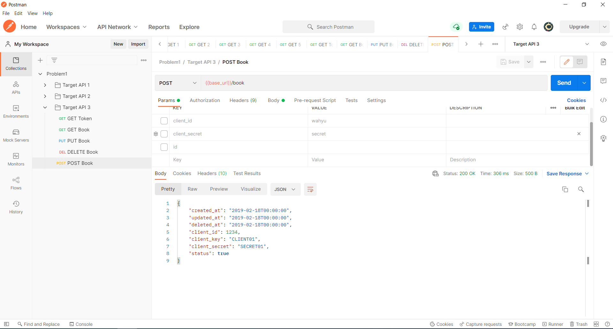

# (20) Intro RESTful API
## Summary
Materi pada pembelajaran section ini meliputi:
1. Pengertian API
2. Bagaimana API bekerja
3. REST (Representational State Transfer)
4. Postman

#### Pengertian API
API adalah kumpulan fungsi dan procedur yang mengizinkan aplikasi untuk mengakses fitur data dari sistem operasi, aplikasi, atau servis.

#### Cara kerja API
Client yang dalam artian adalah aplikasi (web/mobile) melakukan request atau permintaan ke sebuah layanan pada server. Selanjutkan server akan memberikan respon kepada client.

#### REST
Format request dan response:
1. Json
2. XML
3. SOAP

Metode HTTP Request (yang paling sering digunakan):
- GET
- PUT
- POST
- DELETE

Kode - kode response HTTP (status response):
- 200 : OK
- 201 : Created
- 400 : Bad request
- 401 : Unauthorized
- 404 : Not Found
- 405 : Method not allowed
- 500 : Internal server error

#### Postman
Postman adalah tools http client yang berguna untuk melakukan testing pada sebuah layanan web.

## Task
#### 1. Melakukan http request GET
Target API : https://newsapi.org  
base_url : https://newsapi.org/v2

Screenshot GET method:  

#### 2. Melakukan http request GET
Target API : https://swapi.dev  
base_url : https://swapi.dev/api/

Screenshot GET method:  

#### 3. Mencoba method GET, PUT, POST dan DELETE
Target API : https://virtserver.swaggerhub.com
base_url : https://virtserver.swaggerhub.com/sepulsa/RentABook-API/1.0.0

Screenshot GET Token :  

Screenshot GET Book :  

Screenshot PUT Book :  

Screenshot DELETE Book :  

Screenshot POST Token :  

