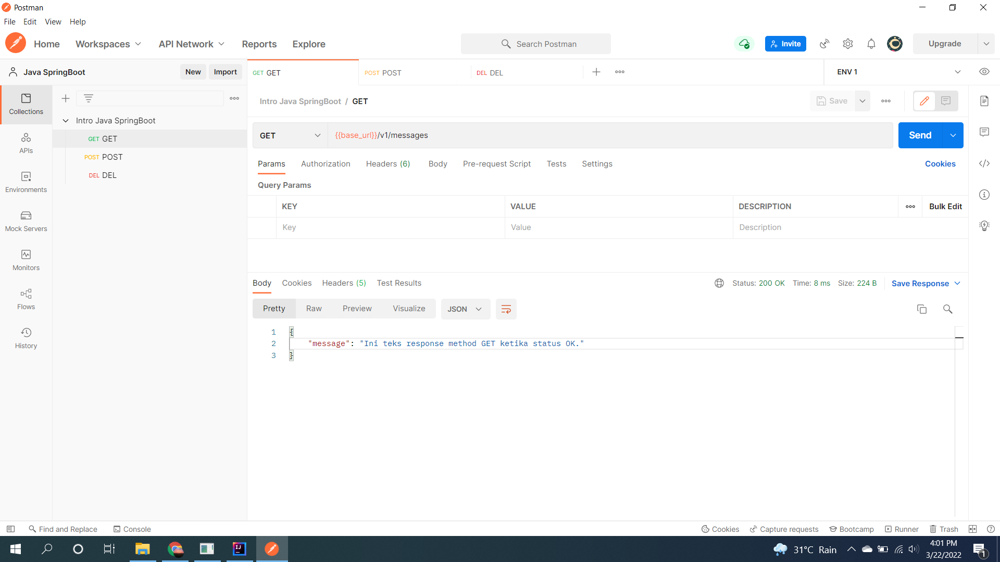
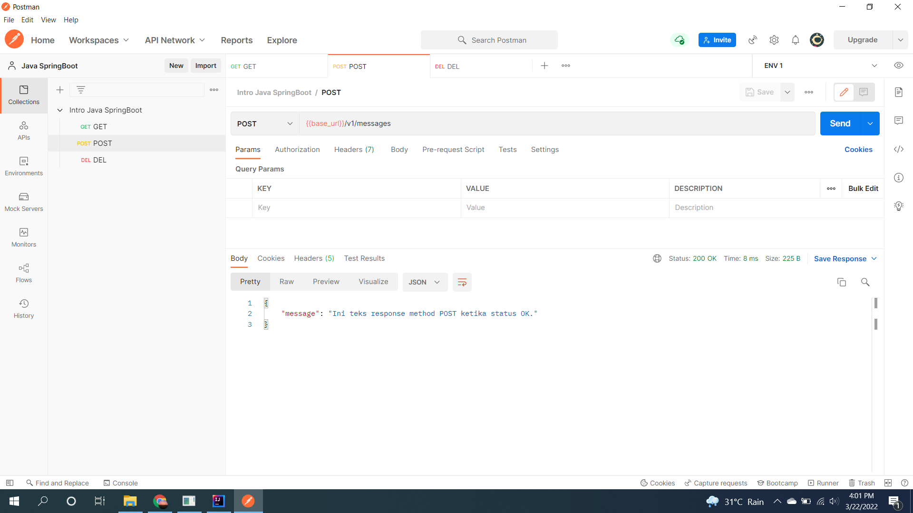
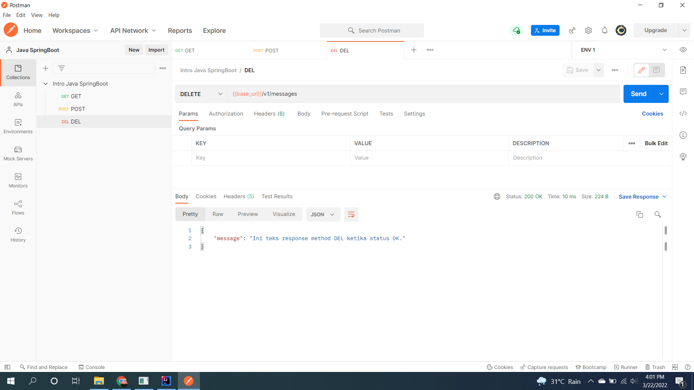

# (21) Intro Spring Boot (Maven - Dependency - Pom)
## Summary
Pembelajaran pada section ini meliputi:
1. Dependency
2. Membuat Project Springboot
3. Running project

#### Dependency
Dependency seperti library, atau build tools. Yang digunakan kedepannya adalah build tools dengan Maven.

#### Membuat project springboot
Membuat project springboot dapat dilakukan dengan plugin di intellij "Spring Initializr" atau dengan menggunakan laman "start.spring.io".  
Saat membuat project agar sesuai dengan pembelajaran gunakan dependency maven dan bahasa Java.  
Dependency standar yang perlu ditambahkan yaitu Spring Web, karena akan membuat web server.

#### Running project
Running project springboot dapat dilakukan dengan command "mvn clean project" agar mendapatkan file jar, lalu file jar yang didapatkan dapat dijalankan dengan java.  
Selanjutnya ketika web server telah berjalan bisa dilakukan percobaan dengan membuka localhost:[port] , default port 8080.

## Task
#### 1. Say Hello from Springboot
Membuat project springboot dengan endpoint 'v1/message' dan dengan method GET, POST, DELETE akan menampilkan response berupa message.
- Method GET  
  
  
- Method POST  
  
  
- Method POST  
  

#### 2. Perbedaan tiap endpoint
1. Pada method GET yang akan dijalankan adalah entity response dengan anotasi GET yang dibuat pada project springboot.
2. Pada method POST yang akan dijalankan adalah entity response dengan anotasi POST.
3. Pada method DELETE yang akan dijalankan adalah entity response dengan anotasi DELETE.

