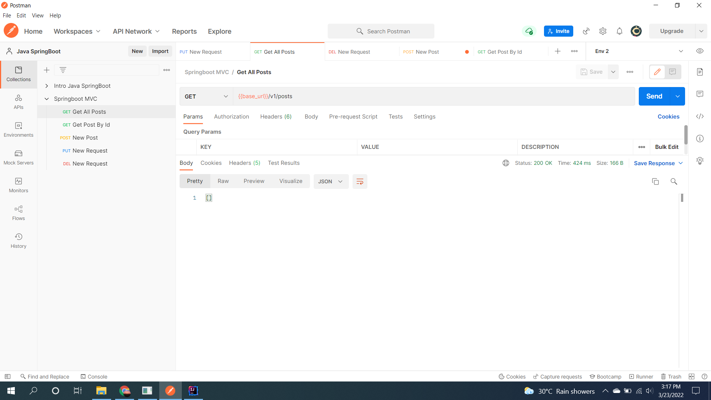
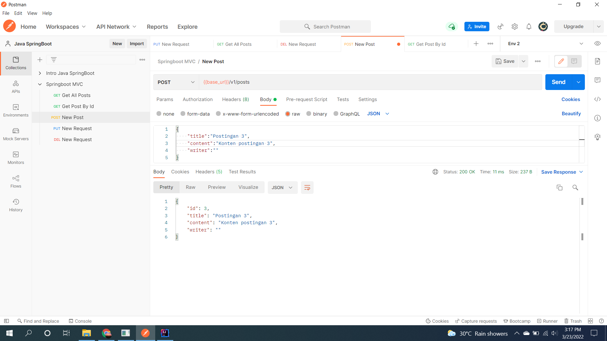
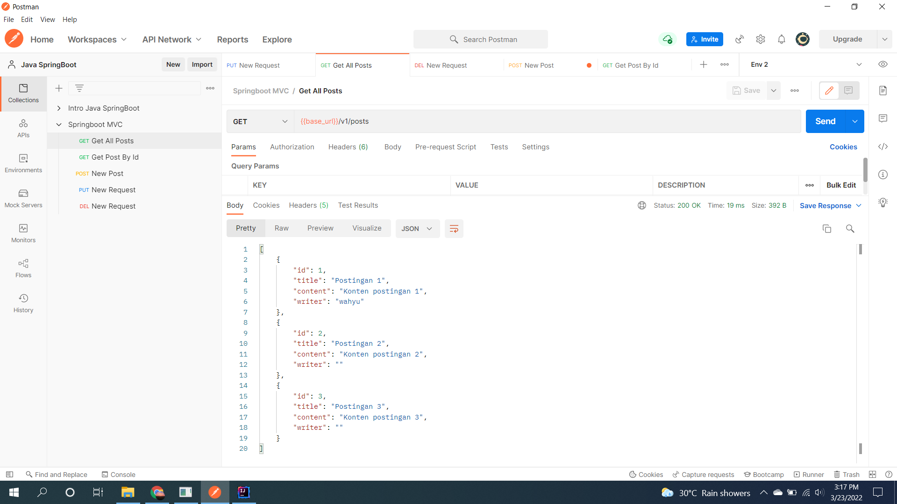
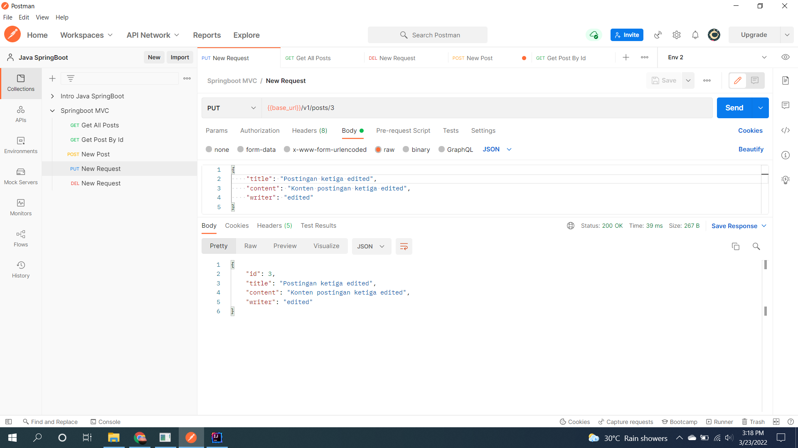
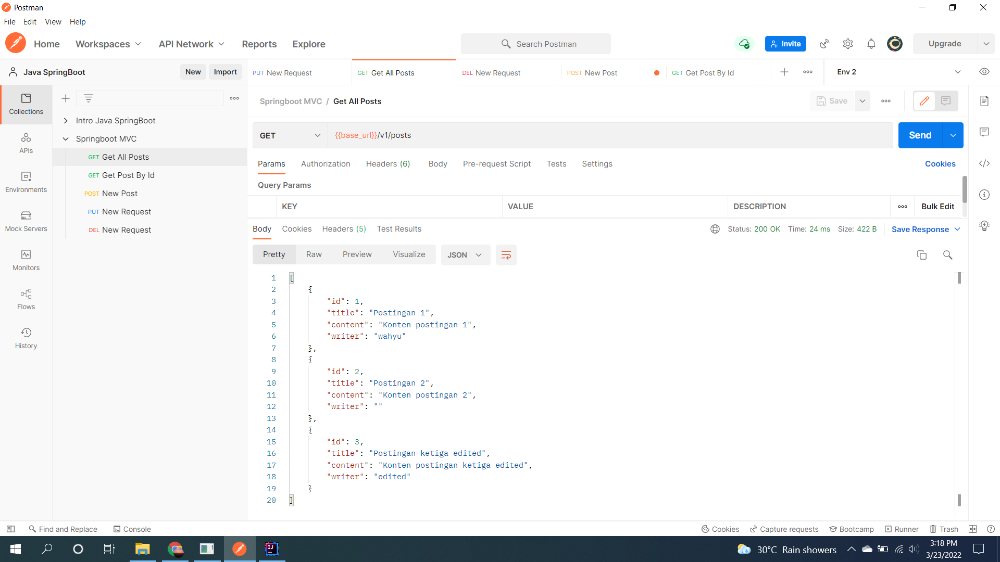
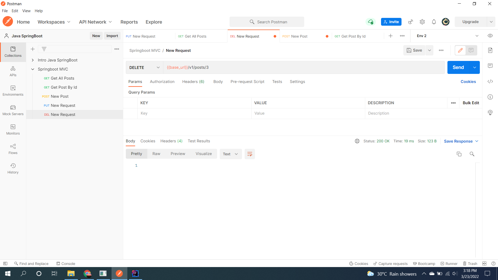
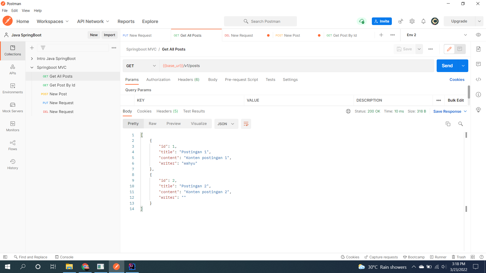

# (22) Getting Started REST Spring Boot (MVC)
## Summary

## Task
#### 1. Problem 1 - H2 Database
1. [GET] all post 1  

  
2. [POST] new 3 posts  
    
  
Result:  

3. [PUT] update post id 3  
  
Result:  

  
4. [DEL] delete post id 3
  
Result:  

