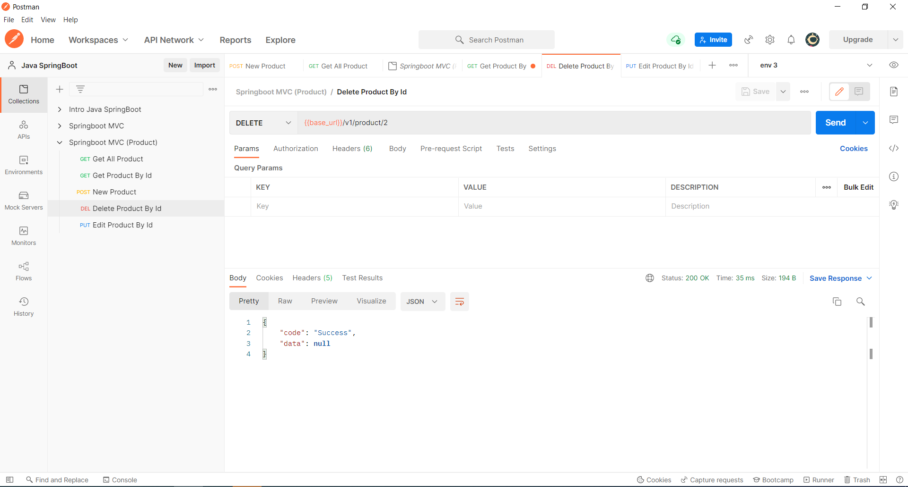

# (23) Configure Swagger Documentation Spring Boot
## Summary
Materi pada section ini meliputi:
1. Dokumentasi API
2. Alasan Membuat Dokumentasi API
3. API Documentation Tools
4. Swagger API Documentation

#### Dokumentasi API
Dokumentasi API adalah konten teknikal untuk mendokumentasi API. Berisi tentang cara - cara untuk mengintegrasikan API.

#### Alasan menggunakan dokumentasi API
Meningkatkan efisiensi pengintegrasian API dan informasi pembaruan.

#### Tools Dokumentasi API
Beberapa contoh tools untuk dokumentasi API:
1. Swagger
2. Postman
3. Apiary
4. Stoplight
5. Redocly

#### Swagger
Alasan menggunakan swagger untuk dokumentasi API:
1. Open Source.
2. Digunakan oleh perusahaan besar.
3. Dokumentasi API yang baik.

## Task
#### 1. Membuat CRUD Product
1. Get All Product

2. Create 3 new Product

  
    Result:  

3. Get By Id = 3

4. Edit Id = 3

  
    Result:  

5. Delete id = 2

  
    Result:  

#### 2. Membuat dokumentasi API dengan Swagger
Screenshot halaman swagger:
