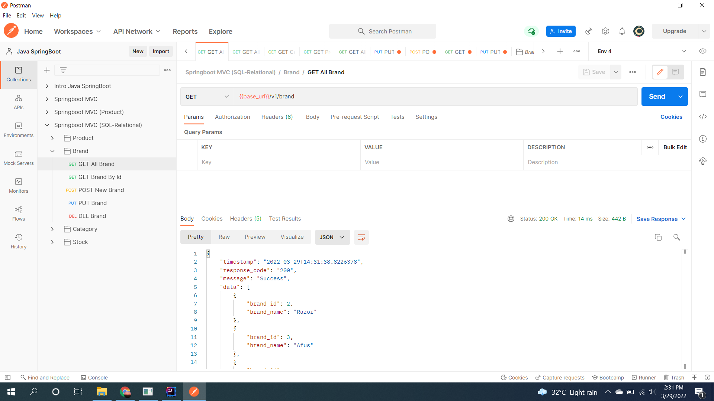
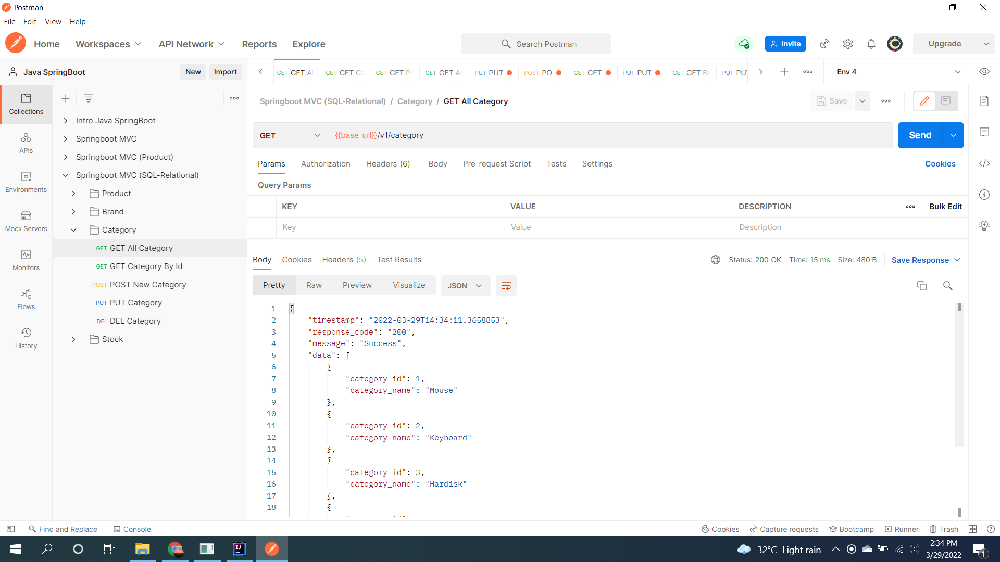
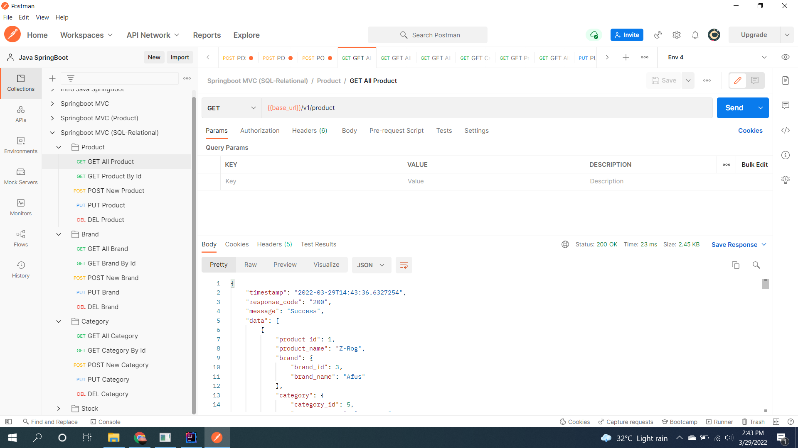
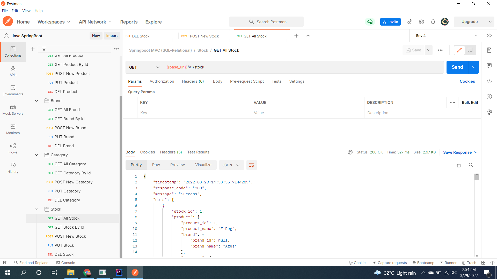
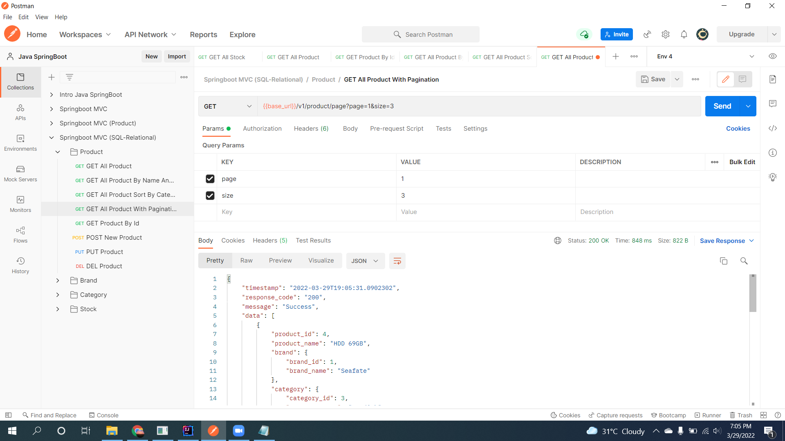
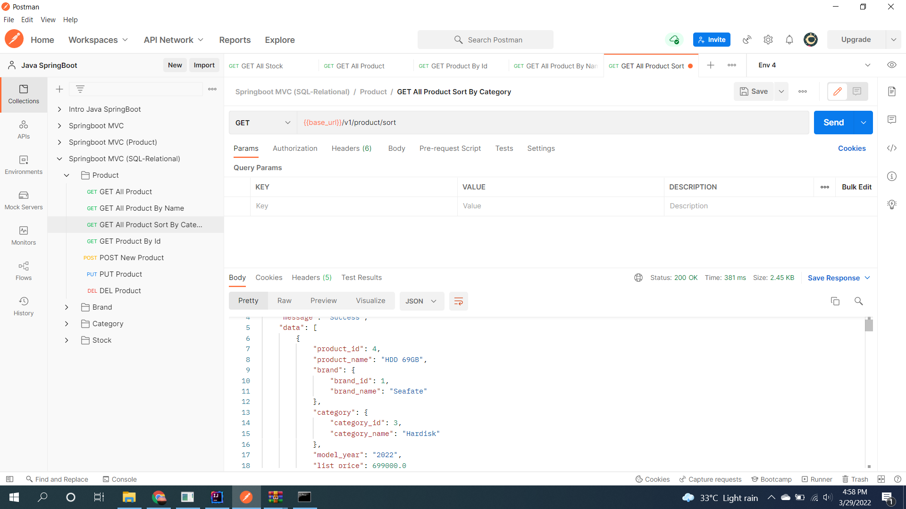
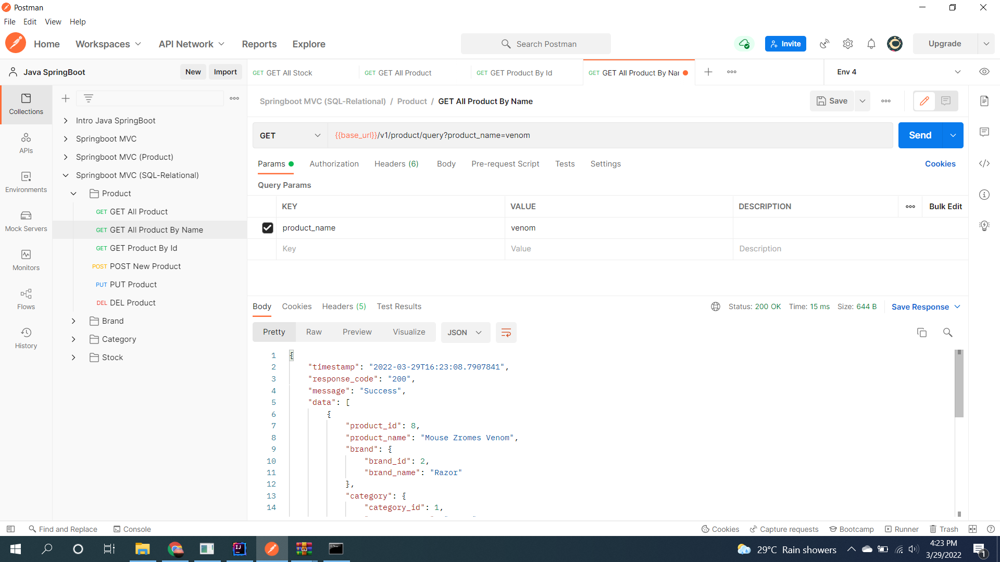

# (25) Impementation Relational (1o1 - 1oMany - ManyoMany)
## Summary
Materi pada section ini adalah sebagai berikut:
1. SQL Advance
  - Query like, avg, max, min dll
2. Cardinalitas / relation data
  - inner join
  - left join
  - right join
3. JPA di spring 
4. clean code
  - usahakan nama variable harus jelas tujuan penggunaan
  - nama method 
  - nama class
5. Penggunaan java stream seperti Optional. Digunakan untuk menghandle jika ada data yang tidak ditemukan maka terdapat nilai default.
agar tidak jadi kondisi bersarang.

## Task
### Challenge 1
1. Membuat JPA Relationship berdasarkan skema database yang telah diberikan.
- Brand (One-To-Many with Product)  
Screenshot:  

- Category (One-To-Many with Product)
Screenshot:  

- Product (Many-to-One with Brand and Category)
Screenshot:  

- Stock (One-to-One with Product)
Screenshot:  

2. Membuat beberapa query JPA
- Get all product with category
Screenshot:  

- Paginate Product using Pageable
Screenshot:  

- Sort product by Category
Screenshot:  

- Get product by name
Screenshot:  

