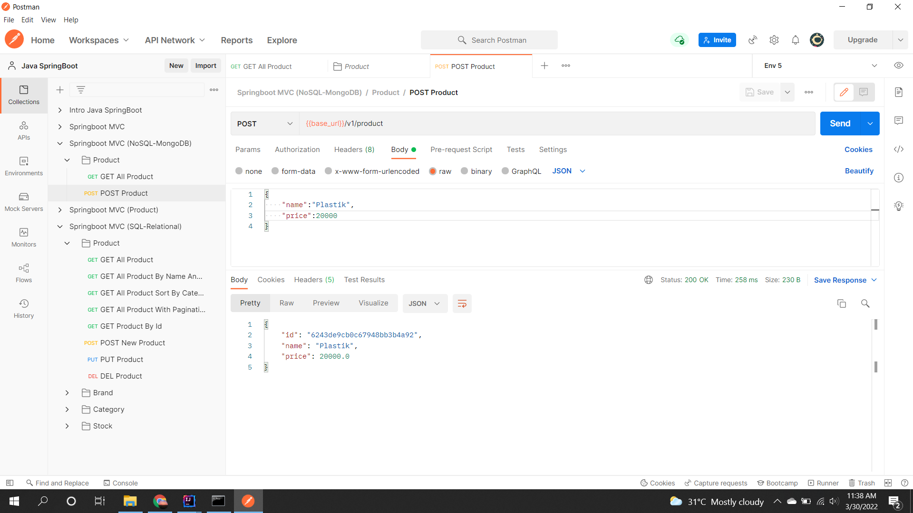
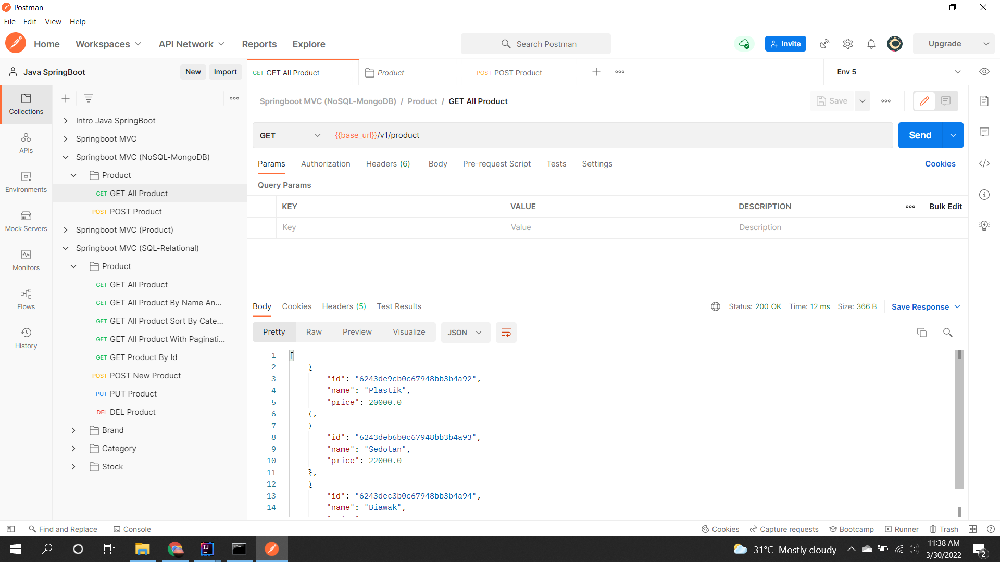
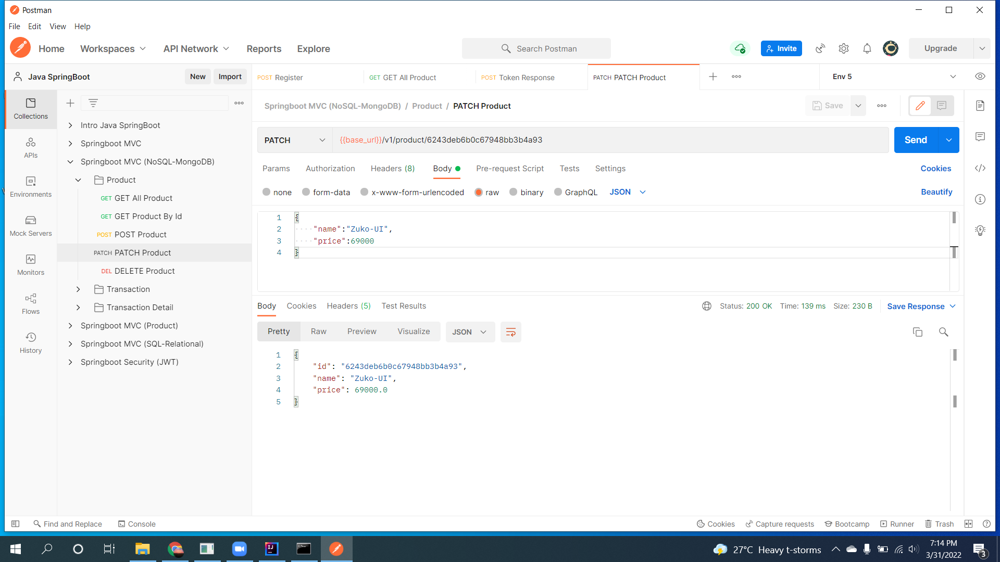
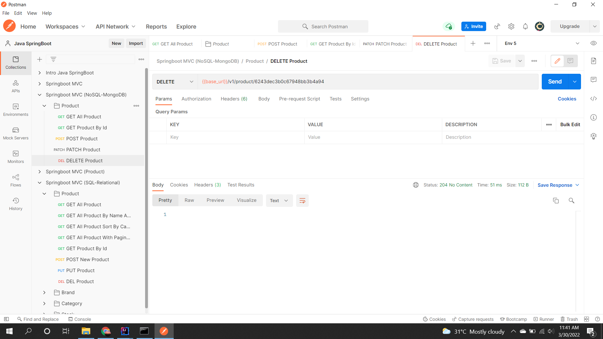

# (26) JPA (Spring Database No SQL)
## Summary
Pada section ini materi yang dipelajari adalah sebagai berikut:
1. Konfigurasi database MongoDB
2. Strukturisasi package model MVC
3. CRUD Method on NoSQL

### Konfigurasi
Untuk menggunakan database MongoDB pada JPA perlu konfigurasi pada file [application.properties](./praktikum/nosqlmongodb-project/src/main/resources/application.properties) dengan setting datasource mongodb dan port default dari mongodb 27017.

### Strukturisasi
Struktur dasar yang diperlukan dalam permodelan MVC adalah package controller, model, repository.

### CRUD Method
Pada NoSQL Database method CRUD hampir mirip dengan database SQL hanya berbeda pada bagian repository yang digunakan yaitu MongoRepository.

## Task
### Membuat project Springboot dengan database MongoDB yang dapat melakukan proses CRUD.
Disini screenshot yang saya contohkan hanya untuk dokumen produk karena dokumen yang lain prosesnya sama.
1. Create
Screenshot:  

2. Read
Screenshot:  

3. Update
Screenshot:  

4. Delete
Screenshot:  
