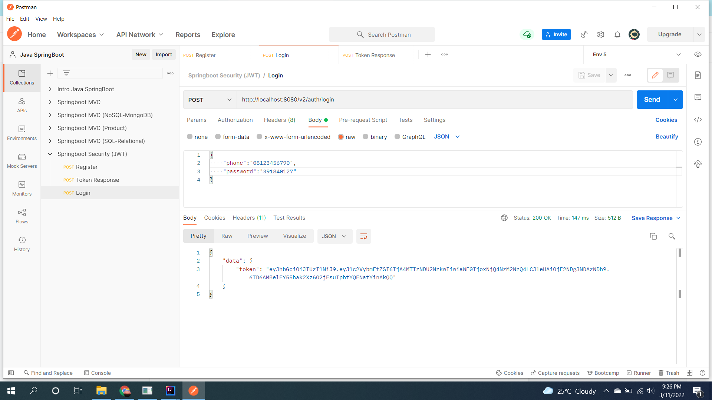
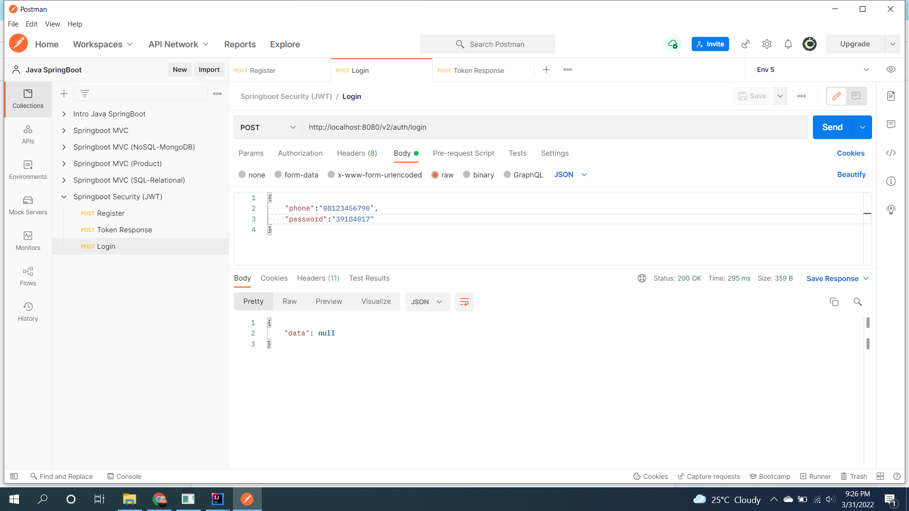
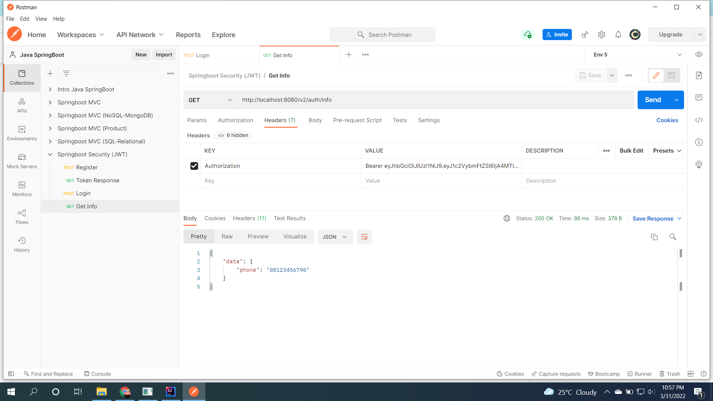

# (27) Spring Security (JWT)
## Summary
Pada section ini materi yang dipelajari adalah sebagai berikut:
1. Spring security
2. Struktur package
3. Configuration

### Spring security
Sebuah framework akses kontrol untuk aplikasi Spring.

### Struktur package
Struktur dasar package yang diperlukan adalah config, model, repository, controller dan security.

### Configuration
Perlu melakukan config terutama untuk user management pada file application.properties

## Task
### Problem 1 - JWT Generation
Melakukan method POST dengan body diisi dengan phone dan password untuk mendapatkan token jwt.
1. Ketika phone dan password benar.
Screenshot:  

2. Ketika phone dan password salah.
Screenshot:  

### Problem 2 - JWT Extraction
Dengan menggunakan method GET, mengisi Header Authorization dengan token JWT dan melakukan ekstraksi.  
Screenshot:  

