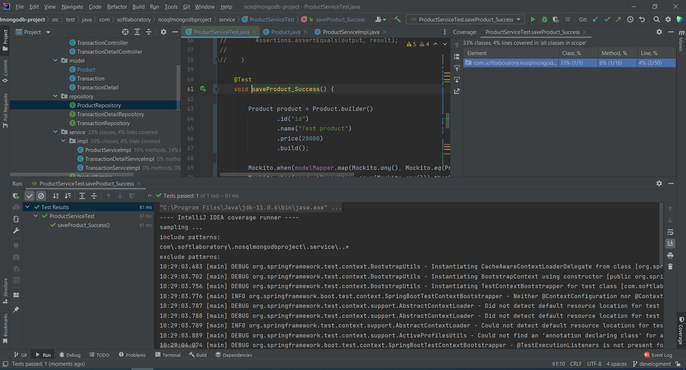
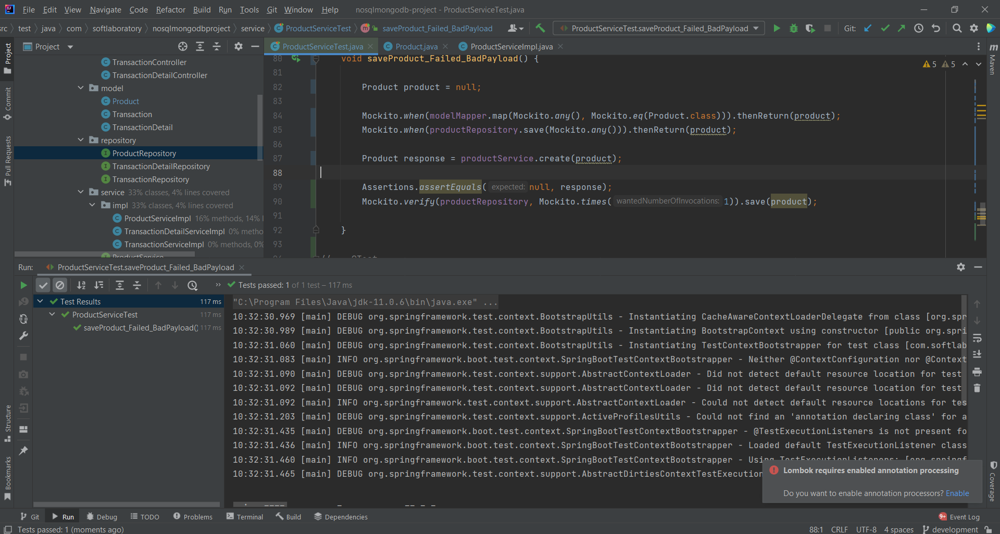
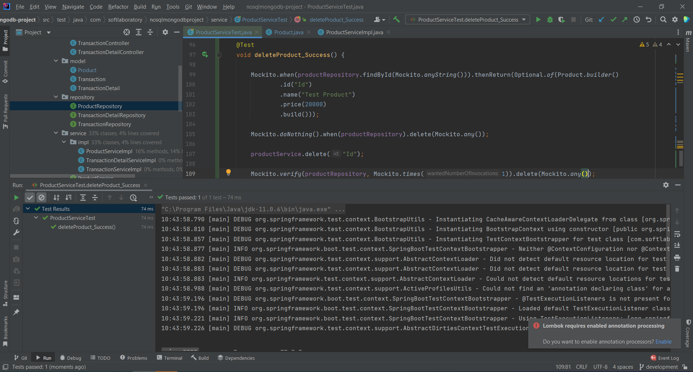

# (28) Unit Testing
## Summary
Pada section ini materi yang dipelajari adalah sebagai berikut:
1. Testing
2. Unit Testing
3. Unit Testing Concern
4. Unit Testing Benefit
5. Unit Testing Principle

### Testing
Terdapat berbagai macam testing, diantaranya adalah:
- Unit Test
- Integration Test
- System Test
- UI Test
- Manual Test

### Unit Testing
Unit testing adalah level software testing yang melakukan testing pada bagian/unit/componen individual.  
Unit merupakan bagian terkecil dalam sebuah aplikasi. Tujuannya adalah memvalidasi setiap unit yang dibuat bekerja sesuai tujuannya.

##### Hal - hal yang diperhatikan dalam Unit Testing:
- Ketepatan fungsi dan keutuhannya
- Penanganan error
- Parameter atau nilai input
- Ketepatan output
- Performa

##### Keuntungan melakukan Unit Testing
- Mengetahui kualitas kode
- Menemukan bug lebih awal
- Pengembangan lebih cepat
- Desain lebih baik
- Mengurangi biaya

##### Prinsip Unit Test
- Fast
- Isolated/Independent
- Repeatable
- Self-validating
- Thorough

## Task
### Melakukan Unit Testing
Melakukan Unit Testing minimal 3 pada bagian service pada project Springboot sebelumnya yang dibuat dengan database NoSQL Mongodb.
1. Save success
Screenshot:  

2. Save failed bad payload
Screenshot:  

3. Delete success
Screenshot:  
