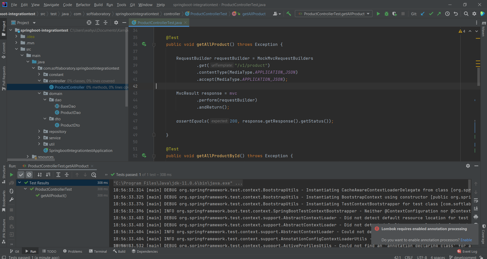
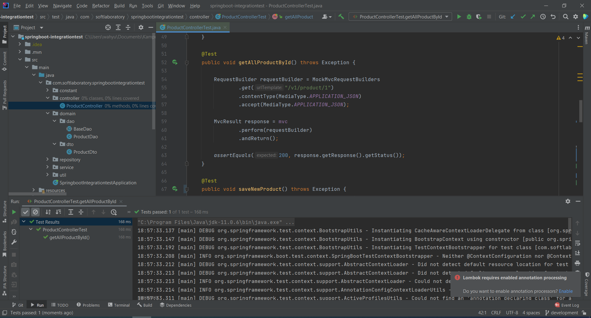
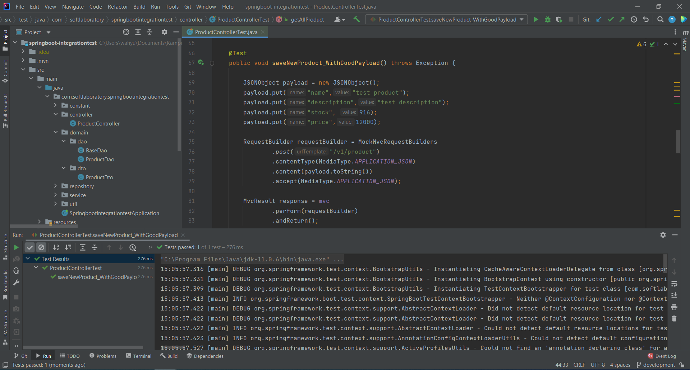
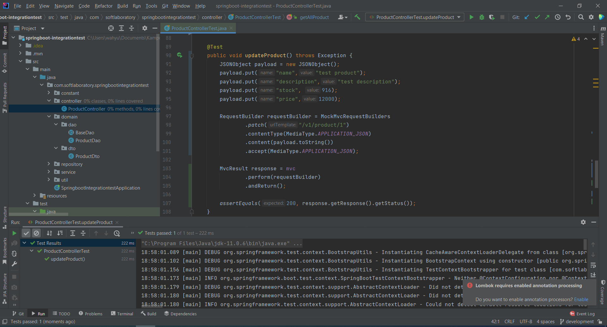
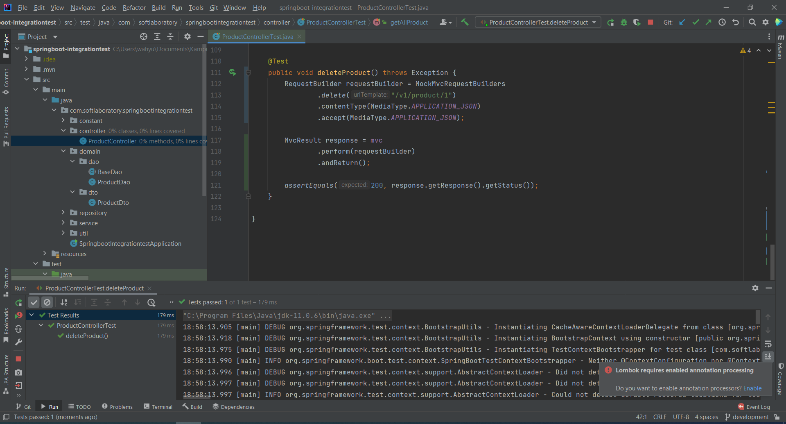

# (29) Integration Testing
## Summary
Materi yang dipelajari pada section ini adalah sebagai berikut:
1. Software Testing
2. Tipe Software Testing
3. Integration Testing

### Software Testing
Software testing adalah metode untuk melakukan pengecekan terhadap produk aplikasi apakah sudah sesuai kebutuhan dan terbebas dari kekurangan.
Software testing diperlukan karena jika terdapat kekurangan pada software bisa menjadi berbahaya.

### Tipe Software Testing
1. Functional Testing
2. Non-Functional Testing
3. Maintenance Testing

### Integration Testing
Testing yang dilakukan pada module dan melakukan testing secara berkelompok.

## Task
Membuat integration testing pada sebuah controller.
- Endpoint get all product  
  
- Endpoint get product by id  
  
- Endpoint save new product  
  
- Endpoint update product  
  
- Endpoint delete product  
  

