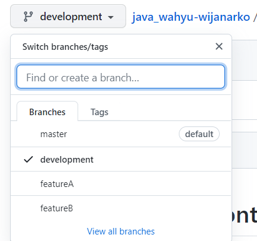
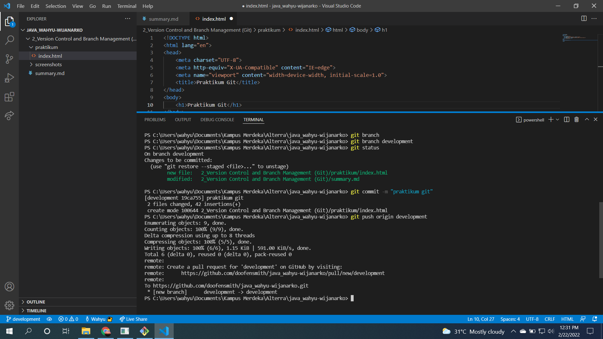
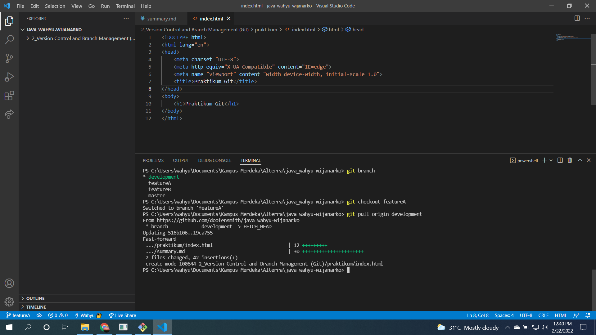
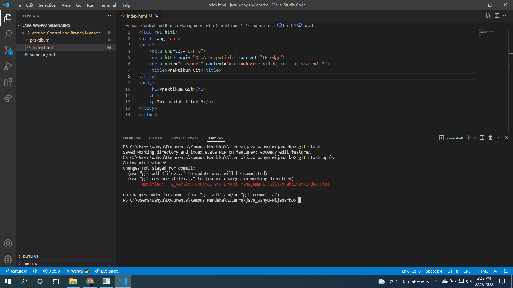
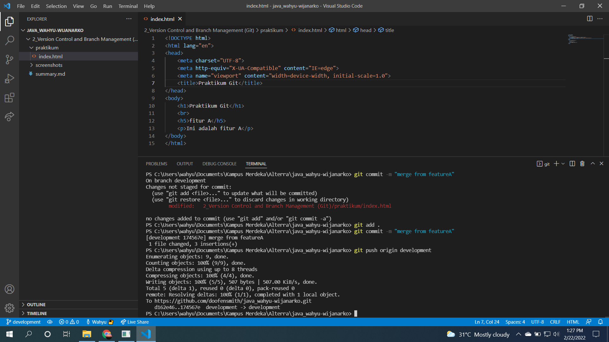
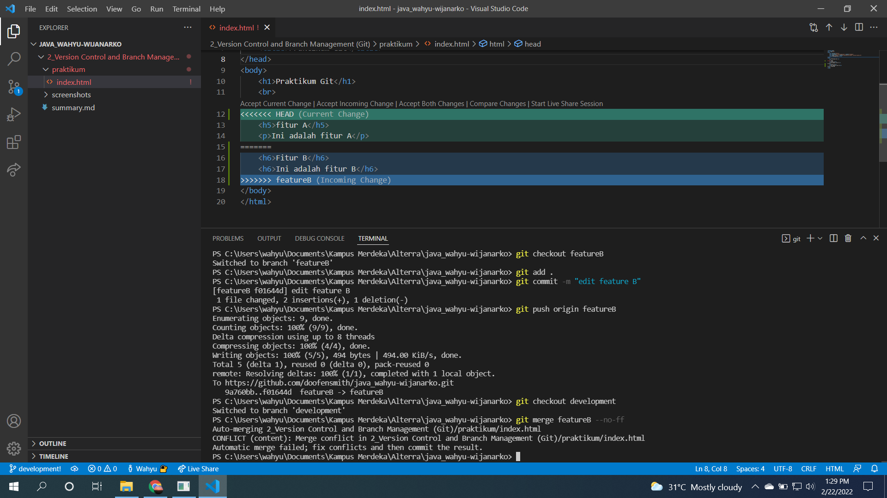
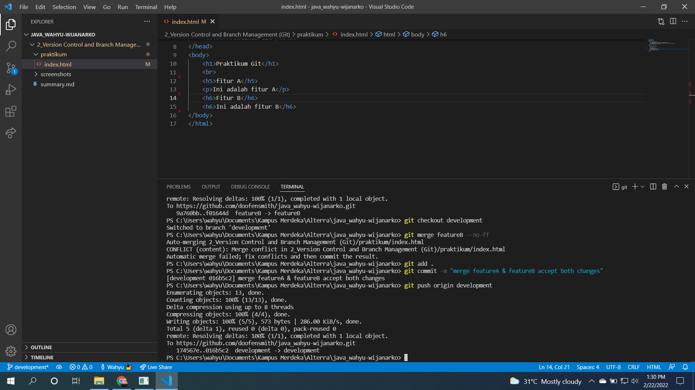

# (2) Version Control and Branch Management (Git)
## Resume
Pembelajaran pada materi ini meliputi:
1. Versioning
2. Git
3. GitHub
4. Beberapa istilah dan command pada git :
    - init
    - add
    - commit
    - status
    - push
    - stash
    - stash apply
    - gitignore
    - log --oneline
    - reset (commitid) (--soft/--hard)
    - fetch
    - pull
    - branch
    - checkout
    - merge
    - pull request
  
#### Versioning
adalah mengatur sebuah versi dari source code program. Berdasarkan sebuah masalah yang disebut "revisi". Penulisan source code pasti terjadi yang namanya revisi sehingga *versioning* pasti dilakukan. Banyak terdapat tools untuk melakukan *versioning* seperti *Version Control System*.
  
#### Git
adalah salah satu *Version Control System* yang populer untuk digunakan oleh para developer mengembangkan software bersama - sama. Git mencatat setiap perubahan yang terjadi pada file dan biasa catatan tersebut disebut sebagai **commit** dan kita bisa mengembalikan ke versi yang tercatat. Untuk menggunakan Git kita harus membangun Git server.

#### GitHub
adalah layanan hosting yang populer untuk Git.
  
## Task
#### 1. Branching
Pada task ini, membuat branch development, featureA dan featureB pada repository.  
Berikut ini adalah screenshot command pembuatan branch:  
  
Hasil yang didapatkan setelah membuat branch:  

#### 2. Push
Pada task ini melakukan eksekusi untuk command push. Membuat 1 file index.html dan melakukan commit lalu push ke branch development.  
Berikut ini adalah screenshot untuk eksekusi command push:

#### 3. Pull
Pada task ini melakukan eksekusi untuk command pull. Melakukan pull branch development ke dalam branch featureA.  
Berikut ini adalah screenshot saat melakukan pull dari branch development:

#### 4. Stash
Pada task ini mencoba melakukan command stash.  
Berikut ini adalah screenshot saat mencoba command stash:

#### 5. Merge
Pada task ini melakukan merge dengan option no fast forward (--no-ff) dari branch featureA ke development.
Berikut ini adalah screenshot hasil merge:

#### 6. Merge (Conflict)
Pada task ini melakukan merge dengan option no fast forward dari branch featureB ke development dan seharusnya terjadi **CONFLICT** dikarenakan terdapat source code yang berbeda pada file dan line yang sama.
Berikut ini screenshot terjadinya conflict:

Pemecahaan conlict yang diambil yaitu **ACCEPT BOTH CHANGES** dengan screenshot berikut:
 
