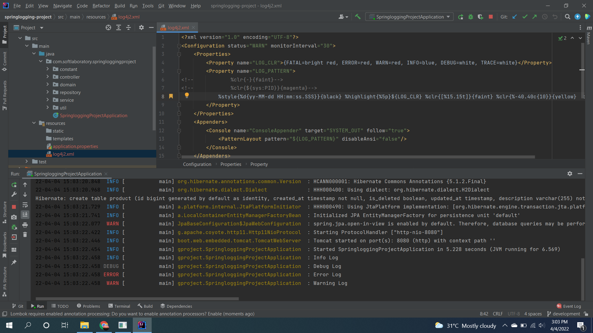

# (30) Logging in Spring Boot
## Summary
Pada section ini materi yang dipelajari adalah sebagai berikut:
1. Logging
2. Keuntungan Logging
3. Logging Tools
4. Java Spring Logging
5. Level Logging

### Logging
Logging merupakan proses pengumpulan data pada sebuah periode waktu untuk menganalisa kejadian - kejadian pada sebuah sistem yang sedang berjalan.
Hal ini memungkinkan untuk melakukan tracking pada semua kejadian bahkan interaksi antara data dengan penyimpanan, aplikasi, atau file yang diakses.

### Keuntungan menggunakan logging
Jika tidak menggunakan logging dan terjadi suatu masalah pada sistem kita, maka kita akan sangat sulit untuk mendeteksi bagian mana yang mengalami masalah. 
Kita juga dapat mendeteksi bug pada sistem kita lebih cepat.  
Berikut ini beberapa keuntungan menggunakan logging:
- Managemen sumber daya, kita bisa melihat sumber daya yang digunakan seperti penggunaan ram, hdd, cpu.
- Pendeteksian masalah pada aplikasi.
- Analisis bisnis.

### Tools yang biasa digunakan untuk logging
- Retrace
- logentries
- logz.io
- graylog
- splunk logging

### Java Logging
Pada Java terdapat configurasi standar yang biasa digunakan untuk logging yaitu Apache log4j

### Level - level pada Logging
Level - level pada logging yaitu:  
- Trace
- Debug
- Info
- Warn
- Error
- Fatal

## Challenge
Membuat logging custom.  
File custom log4j:  
[log4j2.xml](./praktikum/springlogging-project/src/main/resources/log4j2.xml)

Screenshot :  

