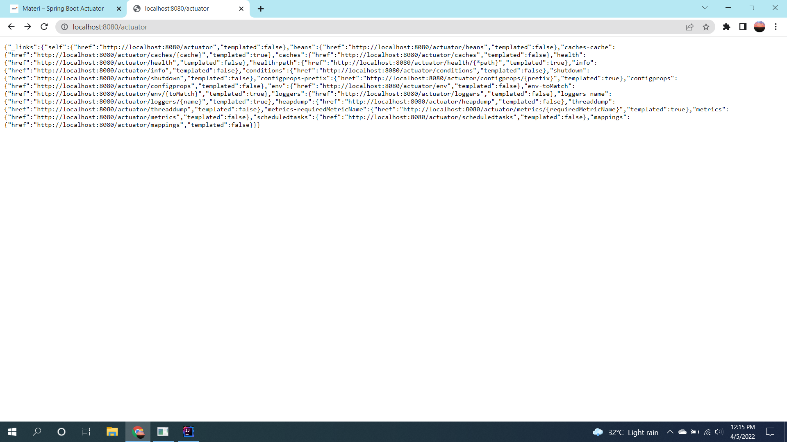
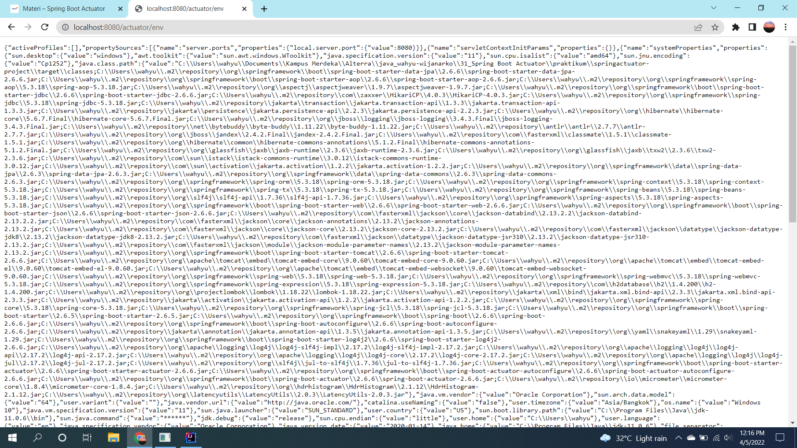

# (31) Spring Boot Actuator
## Summary
Materi yang dipelajari pada section ini adalah sebagai berikut:
1. Software Environment Development
2. Level Environment Development
3. Alasan menggunakan banyak environment
4. Spring Actuator

### Software Environment Development
Software Environment Development adalah lingkungan atau environment yang mengotomatisasikan kegiatan terkait pada lingkaran proses pengembangan software.

### Level dari Environment Development
- Development Environment, pengerjaan fitur
- Staging Environment, melakukan test pada fitur
- Production Environment, user bisa melihat semua fitur

#### Alasan menggunakan environment
- Mudah untuk memanage fitur sebelum dirilis ke produksi.
- Mencegah banyak bugs.
- Memberikan fitur yang siap dengan kualitas tinggi ketika dirilis ke produksi.

#### Development Stages
Tahapan development:
- Planning
- Analysis
- Design
- Coding/Implementation
- Testing
- Patching/Maintenance

#### Software Development Life Cycle
Tahapan SDLC:  
- Planning and Analysis
- Design
- Implementation/Coding
- Testing
- Maintenance

### Spring Actuator
Membantu memonitor dan memanage aplikasi ketika saat produksi dengan endpoint http.

## Task
Menambahkan Springboot actuator pada project sebelumnya dan membuat endpoint actuator.  
Menambahkan dependency spring-starter-actuator pada file  
[pom.xml](./praktikum/springactuator-project/pom.xml)  

Menambahkan beberapa properties untuk membuka semua endpoint actuator pada file  
[application.properties](./praktikum/springactuator-project/src/main/resources/application.properties)

Screenshot:  
1. Endpoint /actuator  

2. Endpoint /actuator/env
