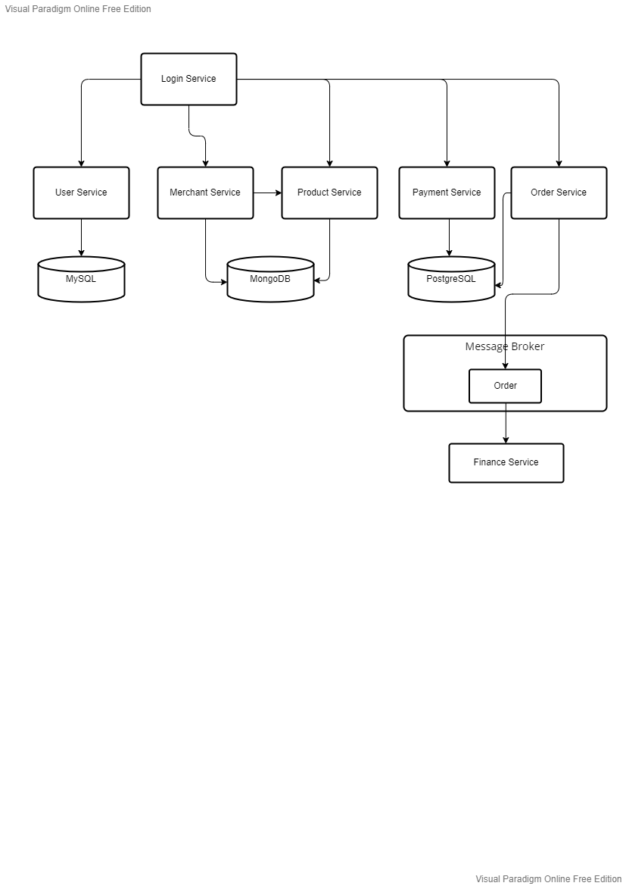

# (32) Introduction Microservices and Spring Cloud
## Summary
Materi yang dipelajari pada materi ini meliputi:
1. Pengertian Microservices
2. Kelebihan Microservices
3. Masalah Microservices
4. Perbandingan Monolithic dan Microservices

### Pengertian Microservices
Microservices adalah:
- Aplikasi - aplikasi kecil yang saling bekerja sama.
- Independen, proses deploy tidak bergantung service lain.
- Setiap komponen dibuat dalam service.
- Bisa berkomunikasi antar service dengan network-call.

### Kelebihan Microservices
Kelebihan menggunakan arsitektur microservices:
- Mudah dimengerti karena dibagi per service.
- Lebih mudah didevelop, maintain dan deploy.
- Bisa dikerjakan dalam tim - tim kecil.
- Scaling mudah.

### Masalah Microservices
Kekurangan atau masalah yang terjadi dalam arsitektur microservices:
- Komunikasi antar services rawan error.
- Testing interaksi antar service lebih sulit.

### Perbandingan Monolithic dan Microservices
Monolithic:
- Simpel
- Konsisten
- Mudah di refactor

Microservices:
- Scaling mudah
- Partial deployment

## Task
Membuat desain alur atau diagram microservices yang terdiri dari minimal 5 services dan terdapat shared database, komunikasi antar services dengan RPC dan Messaging.  

Rancangan microservices:  
