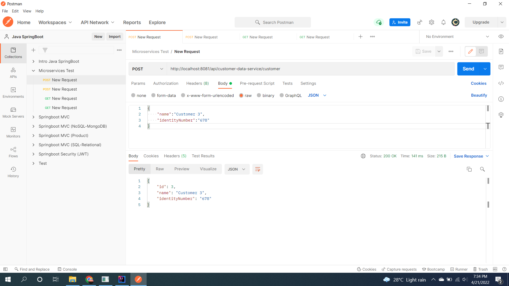
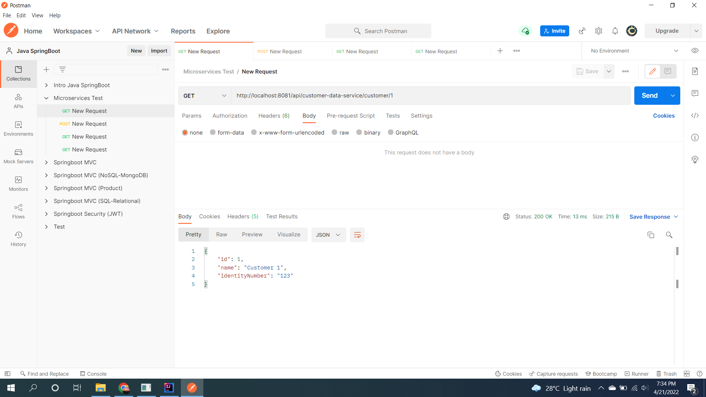
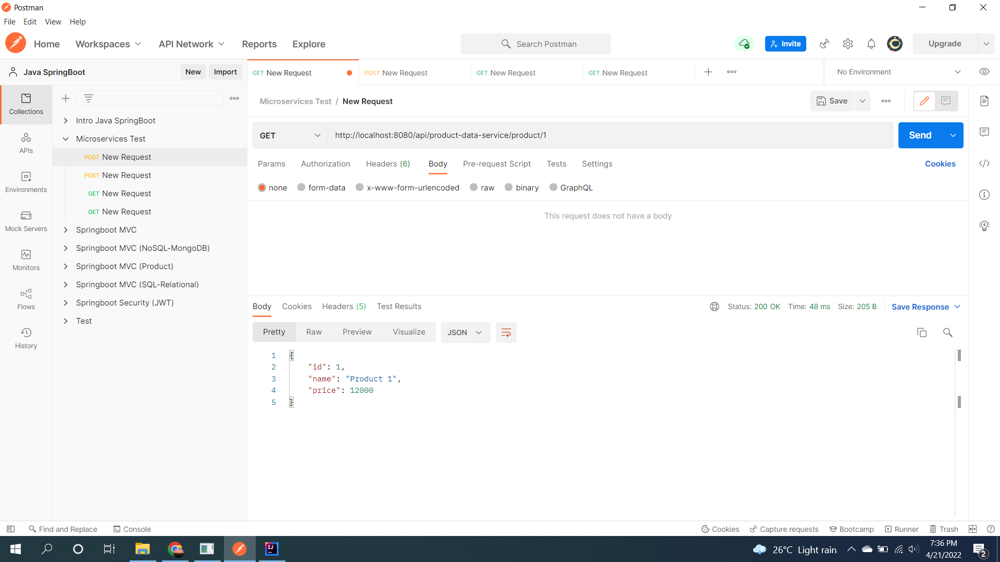
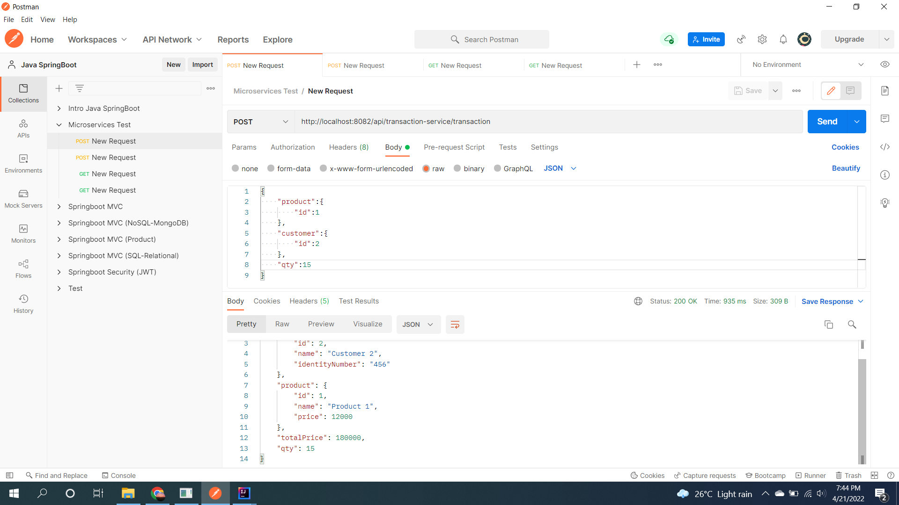

# (33) Implementation Spring Cloud (Microservices)
## Summary
Pada section ini materi yang dipelajari adalah sebagai berikut:
1. Pengertian Microservices
2. Kelebihan Microservices
3. Masalah Microservices
4. Perbandingan Monolithic dan Microservices

### Pengertian Microservices
Microservices adalah:
- Aplikasi - aplikasi kecil yang saling bekerja sama.
- Independen, proses deploy tidak bergantung service lain.
- Setiap komponen dibuat dalam service.
- Bisa berkomunikasi antar service dengan network-call.

### Kelebihan Microservices
Kelebihan menggunakan arsitektur microservices:
- Mudah dimengerti karena dibagi per service.
- Lebih mudah didevelop, maintain dan deploy.
- Bisa dikerjakan dalam tim - tim kecil.
- Scaling mudah.

### Masalah Microservices
Kekurangan atau masalah yang terjadi dalam arsitektur microservices:
- Komunikasi antar services rawan error.
- Testing interaksi antar service lebih sulit.

### Perbandingan Monolithic dan Microservices
Monolithic:
- Simpel
- Konsisten
- Mudah di refactor

Microservices:
- Scaling mudah
- Partial deployment

## Task
Implementasi microservices dengan minimal 3 services, 1 service sebagai orchestrator.  
1. Service Customer Data
    - Save customer  
   Screenshot:  
   
    - Get Customer By Id
   Screenshot:  
   

2. Service Product Data
    - Save product
   Screenshot:  
   
    - Get Product By Id
   Screenshot:  
   

3. Transaction Service  
    Screenshot:  
    