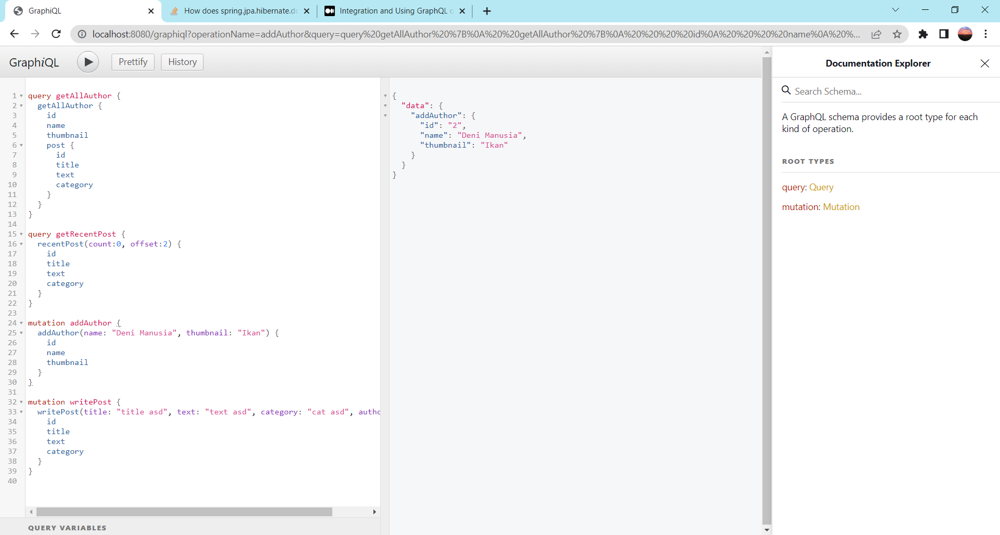
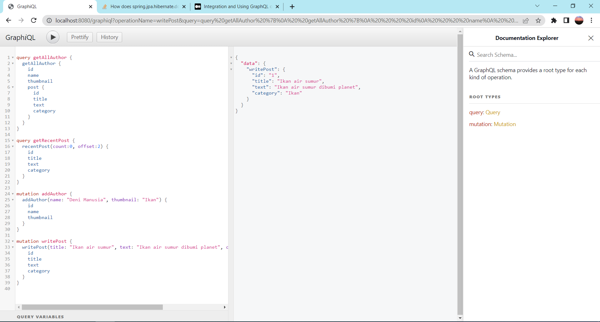
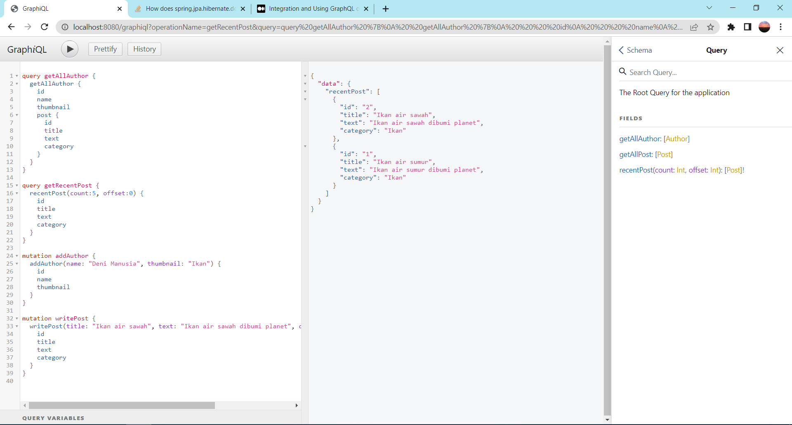

# (36) Graph QL with Spring Boot
## Summary
Materi pada section ini adalah sebagai berikut:
1. GraphQL
2. Konsep GraphQL
3. GraphQL vs Restful API

### Definisi GraphQL
GraphQL adalah query language pada API.

### Konsep GraphQL
Konsepnya adalah hanya menggunakan 1 endpoint untuk terhubung ke database.

### GraphQL vs Restful API
Pada Restful API:
- Untuk mengambil data menggunakan GET
- Untuk mengupdate data menggunakan PUT/PATCH
- Untuk membuat data menggunakan POST
- Untuk menghapus data menggunakan DELETE

Pada GraphQL:
- Untuk mengambil data menggunakan Query
- Untuk memanipulasi data meggunakan Mutation

### Task
Mengimplementasikan graphQL dengan schema yang telah diberikan.  
Schema graphql : [schema.graphqls](./praktikum/graphql-project/src/main/resources/graphql/schema.graphqls)  
Query : getRecentPost  
Mutation : writePost  
  
Hasil eksekusi graphql:
1. Pertama menambah data Author  
Screenshot:  

2. Mencoba write post  
Screenshot:  

3. Mencoba get recent post  
Screenshot:  
