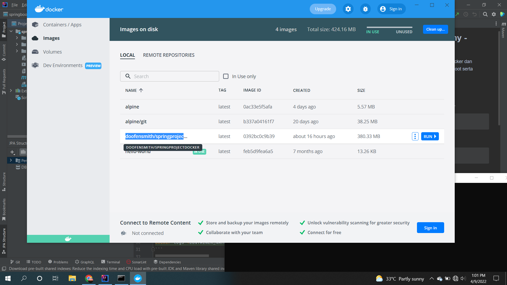

# (37) Docker Container with Microservices
## Summary
Materi yang dipelajari pada section ini adalah sebagai berikut:
1. Docker
2. Keuntungan Docker
3. Docker vs VM Architecture
4. Docker Konsep

### Docker Definition
Docker adalah platform untuk developing, shipping dan running sebuah aplikasi. 

### Keuntungan menggunakan Docker
1. Portability
2. Performance
3. Agility
4. Isolation
5. Scalability

### Docker vs Virtual Machine
Virtual Machine menggunakan Guest OS dan librarynya terpisah.  
Docker menggunakan Container.

### Konsep Docker
1. Dockerfile
2. Docker Images
3. Docker COntainer
4. Docker Hub
5. Docker Engine
6. Docker Daemon
7. Docker Compose

## Task
Membuat image docker dari sebuah project springboot.
Langkah - langkah :
1. Membuat Dockerfile  
[Dockerfile](./praktikum/springproject-docker/Dockerfile)
2. Docker image  
