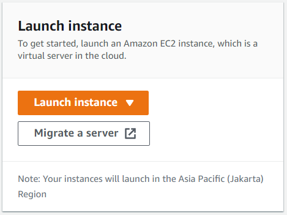

# (38) Compute Service
## Summary
Pembelajaran pada section ini adalah sebagai berikut:
1. Pengertian CI/CD
2. Keuntungan CI/CD
3. Perbedaan Manual Deployment dan Automatic Deployment
4. Keuntungan Automatic Deployment
5. Contoh tools untuk CI/CD
6. GitHub Action

### Pengertian CI/CD
CI/CD adalah metode pengembangan aplikasi dengan melakukan pengembangan secara otomatis.  

#### Continuous Integration
Continous Interation adalah pengintegrasian kode ke dalam repository kode kemudian menjalankan pengujian secara otomatis.

#### Continuous Deployment
Continuous Deployment merupakan lanjutan proses dari Continuous Integration dimana code di deploy secara otomatis.

### Keuntungan menggunakan metode CI/CD
- Meningkatkan kecepatan berinovasi dan kemampuan untuk berkompetensi pada marketplace.
- Kode yang sedang dalam produksi bisa menghasilkan uang daripada hanya menunggu untuk di deploy.
- Kualitas kode yang tinggi.

### Perbedaan Manual Deployment dan Automatic Deployment
#### Manual Deployment
Digunakan oleh pengguna tingkat lanjut dimana kontrol pada environment server aplikasi sangat dibutuhkan. Aplikasi diupdate secara manual. 
#### Automatic Deployment
Merupakan praktik yang memungkinkan untuk memberikan kode secara otomatis atau semi-otomatis memalui beberapa tahapan proses pengembangan, mulai dari tahap inisiasi hingga deployment.

### Keuntungan Automatic Deployment
- Mengurangi kemungkinan error.
- Menghemat waktu.
- Konsisten dan terus berulang.

### Contoh tools yang bisa digunakan untuk membantu proses CI/CD
- Jenkins
- GitHub Action
- Circle CI
- GitLab
- Travis CI

#### GitHub Action
GitHub Action mempermudah otomatisasi semua workflow dengan CI/CD kelas dunia. Dapat melakukan build, test, dan deploy melalui GitHub. Membuat review kode, branch management dan pembuatan issue sesuai dengan keinginan kita.

### Task
Deploy springboot project ke sebuah public server dengan AWS.

Langkah - langkah:
1. Membuat instance EC2 pada AWS:
    - Buka dashboard aws console dan klik `Launch instance`  
     
    - Pilih OS Image  
     
    - Buat key pair untuk login, klik `Create new key pair`  
     
    - Berikan sebuah nama dan simpan local key pair yang dibuat.  
     
    - Pada `Network settings` tambahan `Security group rule` sesuai kebutuhan. Sebagai contoh saya menambahkan HTTP agar bisa diakses melalui HTTP atau port 80 dan Postgre dengan port 5432. Kedepannya bagian ini dapat kita edit lagi.  
     
    - Setelah selesai klik `Launch instance`  
     
    - Simpan informasi IP untuk login ke dalam ec2 nantinya.  
     

2. Masuk kedalam OS Image Amazon  
   - Untuk pengguna Windows dapat menambahkan openSSH pada bagian `Apps & Features` agar bisa menggunakan command `ssh` pada powershell windows.  
     
   - Buka windows powershell dan gunakan command berikut untuk login ke ec2.  
   Command : `ssh -i [path] user@host`  
   -i berarti identity_file atau file private_key yang sudah disimpan sebelumnya saat pembuatan instance.  
   user default ec2 adalah `ec2-user` sedangkan host bisa diisi dengan ipv4 publik yang sudah kita simpan sebelumnya.  
   Full command : `ssh -i private_key.pem ec2-user@108.136.240.248`

3. Update OS
Setelah berhasil masuk kedalam OS Amazon Linux lakukan update dengan command `sudo yum update`.  
  
4. Instalasi docker.  
Setelah update OS selanjutnya lakukan instalasi docker dengan command `sudo yum install docker`.  
  
5. Start docker service.  
Setelah melakukan instalasi pada docker maka service docker bisa dijalankan dengan command `sudo service docker start`.  
  
6. Enable docker  
Kita bisa melakukan enable docker pada sistem control agar docker dijalankan setiap sistem direstart.  
Command : `sudo systemctl enable docker`  
  
7. Tambahkan user ec2 ke docker group  
User ec2 dapat ditambahkan kedalam group docker agar tidak perlu menggunakan perintah `sudo`.  
Command : `sudo usermod -a -G docker ec2-user`
8. Deploy docker image  
Selanjutnya kita dapat mendeploy docker image yang kita miliki ke publik.  
Command : `docker run -d --name [name] -p port:expose [image]`  
Keterangan :  
-d digunakan untuk detach, agar proses dapat berjalan di background  
--name untuk customisasi nama image  
-p untuk publish port yang ingin di expose ke port tujuan  

Untuk contoh deploy Springhelloworld repository `piinalpin/springboot-helloworld`  
Command : `docker run -d --name hello1 -p 80:8080 piinalpin/springboot-helloworld`

Setelah proses deploy setesai maka docker image yang berisi project springboot-helloworld dapat diakses melalui ip public.  
  