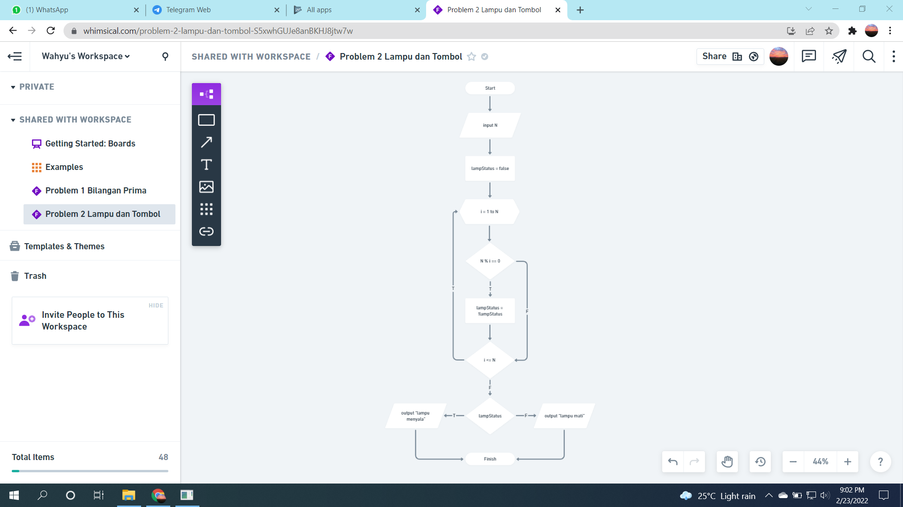

# (3) Introduction Algorithm
## Resume

Pembelajaran pada materi ini meliputi:
1. Algoritma
2. Pseudocode
3. FlowChart

#### Algoritma
adalah prosedur komputasi yang didefinisikan dengan baik yang mengambil beberapa nilai sebagai input dan menghasilkan beberapa nilai sebagai output.

##### Beberapa masalah yang dapat diselesaikan dengan algoritma:
- Check Prime Number
- Sorting
- Searching

##### Karakteristik algoritma:
- Memiliki batas (awal dan akhir)
- Instruksi terdefinisi dengan baik
- Efektif dan Efisien

##### Konsep algoritma dasar:
- Sequential
- Branching
- Looping

#### Beberapa cara penulisan algoritma:
1. Pseudocode
    mirip seperti bahasa pemrograman tetapi lebih mudah untuk dipahami karena bahasanya menggunakan bahasa manusia.

2. FlowChart
    adalah suatu bagan dengan simbol tertentu yang menggambarkan urutan dan hubungan antar proses secara mendetail.

## TASK
#### 1. Bilangan Prima
Pada task ini masalah utamanya adalah diberikan sebuah inputan bilangan bulat. Kita membuat algoritma dengan FlowChart yang dapat memberikan output apakah bilangan yang diinputkan tersebut adalah bilangan prima atau bukan.  
Screenshot FlowChart yang telah dibuat:
  

#### 2. Lampu dan Tombol
Pada task ini masalah utamanya adalah diberikan sebuah inputan bilangan bulat lalu dilakukan perulangan dimulai dari 1 sampai inputan bilangan bulat yang diberikan, kondisi awal lampu adalah mati, jika bilangan habis dibagi perulangan ke saat ini maka status lampu berubah. Membuat algoritma dengan flowchart yang menampilkan status akhir lampu.  
Screenshot FlowChart yang telah dibuat:  
 