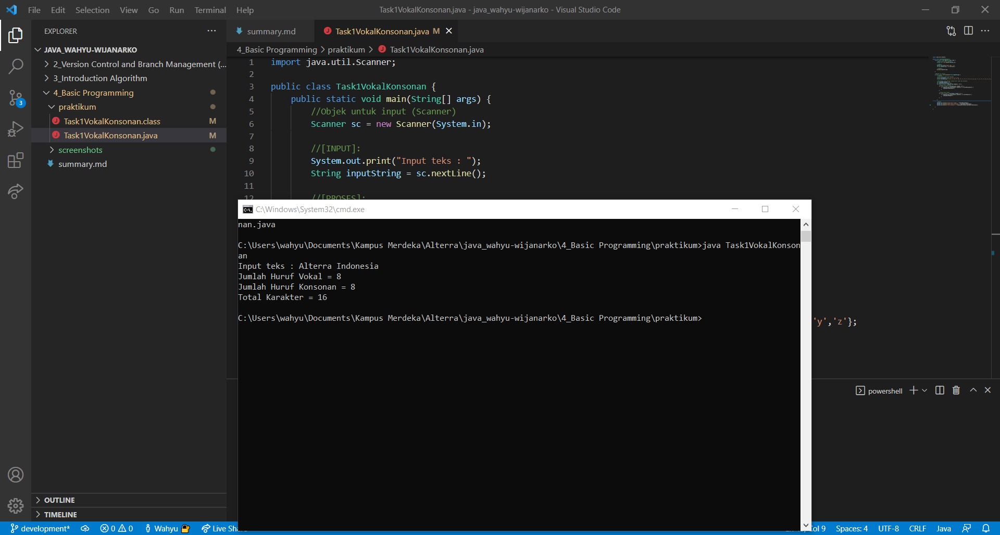
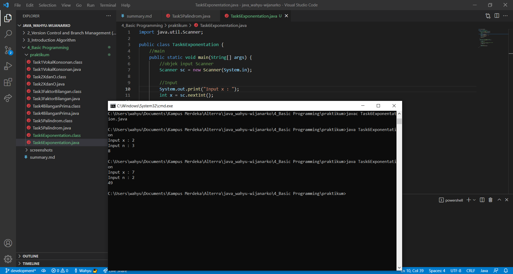

# (4) Basic Programming
## Resume

Pembelajaran pada materi ini meliputi:
1. Java Development
2. Tools (JDK & IDE)
3. Tipe Data
4. Operator
5. Input/Output
6. Branching
7. Looping

##### JDK
JDK adalah Java Development Kit, dapat digunakan untuk :  
- Developing
- Debugging
- Monitoring

##### IDE
IDE adalah Integrated Development Environment, contoh yang sering digunakan adalah :  
- NetBeans
- IntelliJ
- Eclipse

##### Deklarasi variabel pada java
- **tipe_data** nama_variabel = *value*
- **var** nama_variabel = *value*

##### Tipe data pada Java:
1. Bilangan bulat
    - byte (1 byte)
    - short (2 byte)
    - int (4 byte)
    - long (8 byte)

2. Bilangan desimal
    - float (4 byte)
    - double (8 byte)

3. Tipe data lainnya
    - String
    - char
    - boolean

##### Array pada Java:
Ditambah simbol [] pada akhir tipe data, contoh int[] 

##### Branching pada Java:
Menggunakan if, if else, switch.

##### Looping pada Java:
Menggunakan for, while, do-while.

#### Method
Method adalah sebuah metode atau prosedur penyelesaian sebuah masalah yang bisa dengan nilai kembalian atau tidak, dengan parameter atau tidak.

## TASK
#### 1. Vokal Konsonan
Pada task ini masalah utamanya adalah diberikan sebuah inputan berupa String dan melakukan perhitungan seberapa banyak huruf vokal dan huruf konsonan pada inputan String. Output menampilkan jumlah huruf vokal, jumlah huruf konsonan dan total karakter.  
Screenshot code dan hasil yang telah dibuat:
  

#### 2. X dan O
Pada task ini masalah utamanya adalah diberikan sebuah inputan String yang hanya berisi karakter x dan o. Menghitung jumlah karakter x dan karakter 0, jika jumlahnya sama maka output adalah true, jika tidak sama maka output adalah false.  
Screenshot code dan hasil yang telah dibuat:
 

#### 3. Faktor Bilangan
Pada task ini masalah utamanya adalah diberikan sebuah inputan bilangan bulat. Output akan menampilkan faktor - faktor bilangan tersebut.  
Screenshot code dan hasil yang telah dibuat:
 

#### 4. Bilangan Prima
Pada task ini masalah utamanya adalah diberikan sebuah inputan bilangan bulat. Output akan menampilkan apakah bilangan yang diinputkan adalah bilangan prima atau bukan prima.  
Screenshot code dan hasil yang telah dibuat:
 

#### 5. Palindrom
Pada task ini masalah utamanya adalah diberikan sebuah inputan berupa String. Program akan melakukan cek inputan tersebut apakah palindrom (jika dibalik kata yang dibaca tetap sama) atau bukan palindrom.  
Screenshot code dan hasil yang telah dibuat:
 

#### 6. Exponentiation
Pada task ini masalah utamanya adalah diberikan inputan 2 bilangan bulat. Program akan mengalikan bilangan inputan pertama sebanyak bilangan kedua dan menampilkan hasilnya.  
Screenshot code dan hasil yang telah dibuat:
 

#### 7. Segitiga Asterisk
Pada task ini masalah utamanya adalah diberikan sebuah inputan bilangan bulat. Program akan menampilkan output segitiga yang disusun oleh karakter * dengan jumlah baris sebanyak inputan yang diberikan.  
Screenshot code dan hasil yang telah dibuat:
 

#### 8. Tabel Perkalian
Pada task ini masalah utamanya adalah diberikan sebuah inputan bilangan bulat. Program akan menampilkan tabel perkalian dalam bentuk matriks 2 dimensi dengan jumlah baris dan kolom sebanyak inputan yang diberikan.  
Screenshot code dan hasil yang telah dibuat:
 