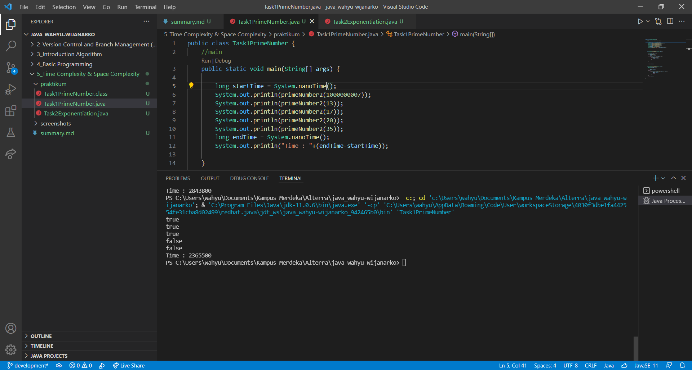

# Time Complexity and Space Complexity
## Resume

Pembelajaran pada materi ini meliputi:
1. Time Complexity
2. Dominant Time
3. Jenis Time - Complexity
4. Space Complexity

##### Time Complexity
adalah ukuran waktu untuk seberapa lamakah operasi - operasi yang dibuat dapat dikerjakan. Operasi dapat berupa aritmetika, pemberian nilai perbandingan dan lainnya. Time Complexity bisa dilihat hanya pada bagian yang paling dominan, misalnya bagian perulangan.  

##### Notasi Time Complexity
notasi pada time komplexity dituliskan dalam Big-O Notation.

##### Jenis Time Complexity
- Constant Time - O(1)
    tidak terdapat proses yang berulang.
- Linear Time - O(n)
    dilakukan dari awal hingga sejumlah nilai n.
- Logarithmic Time - O(log n)
    nilai n dibagi 2 setiap perulangan.
- Quadratic Time - O(n^2)
    terdapat perulangan didalam sebuah perulangan.
- Factorial Time - O(n!)
- Exponential Time - O(2^n)

##### Space Complexity
adalah batas memori yang diharapkan dapat menyelesaikan operasi - operasi yang diberikan.

## Task
#### 1. Prime Number
Algoritma untuk mencari bilangan prima yang lebih cepat dari O(n) atau O(n/2).  
Kode program:  
[Task1PrimeNumber.java](./praktikum/Task1PrimeNumber.java)  
  
Output:

#### 2. Exponentiation
Algoritma untuk mencari pangkat bilangan yang lebih cepat dari O(n).  
Kode program:  
[Task2Exponentiation.java](./praktikum/Task2Exponentiation.java)  
  
Output:

