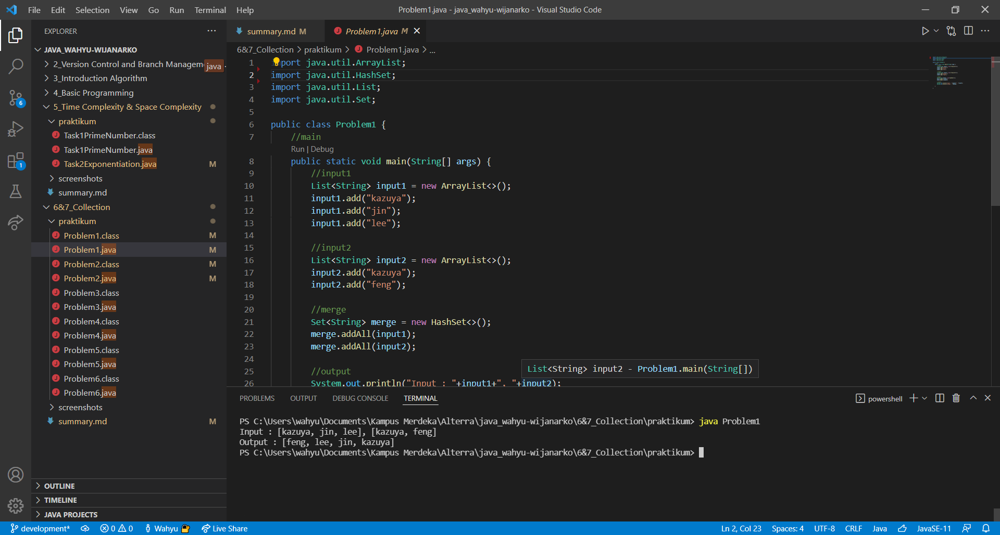
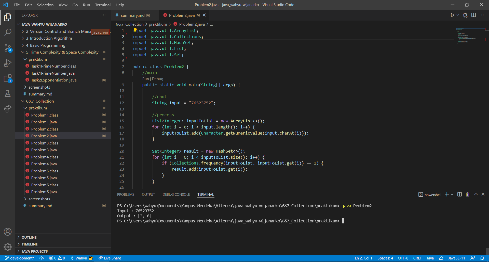
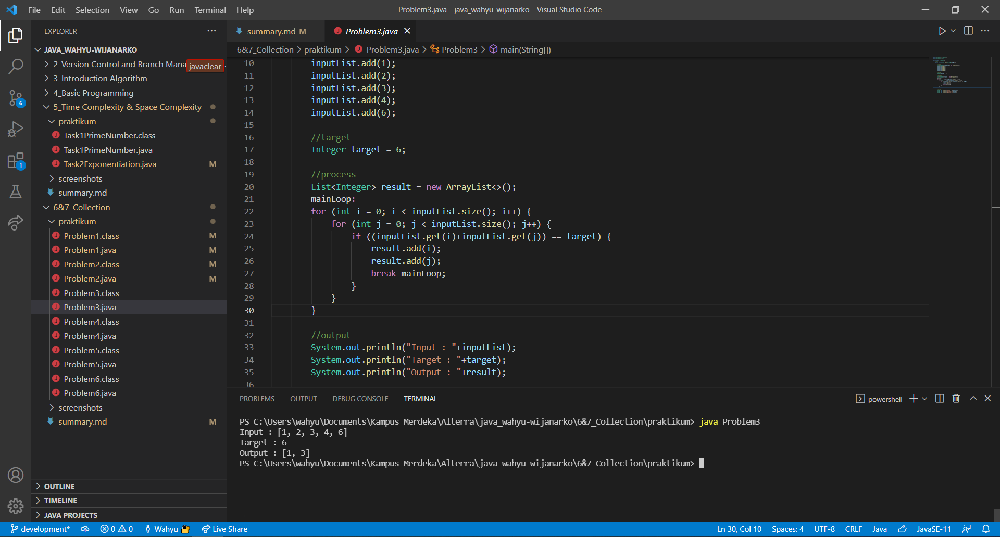
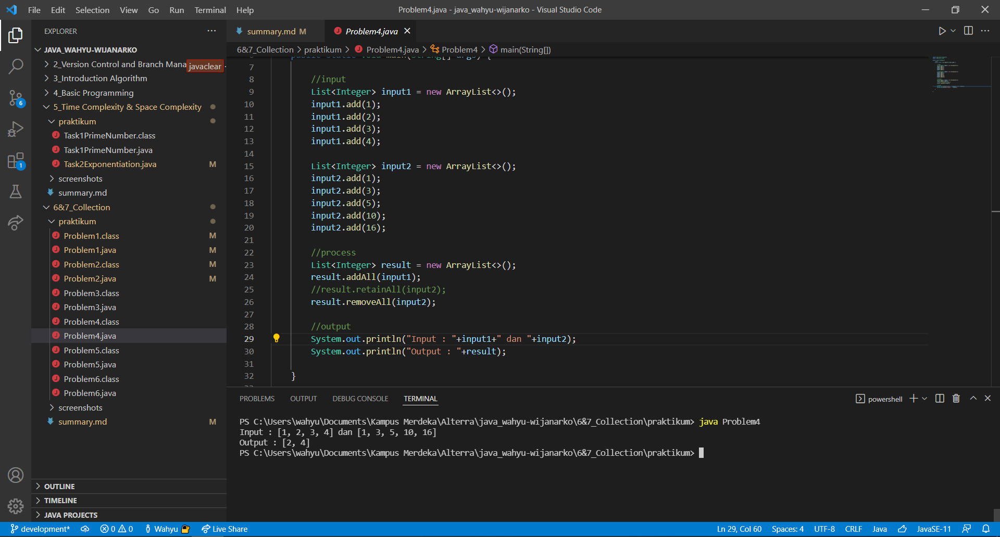
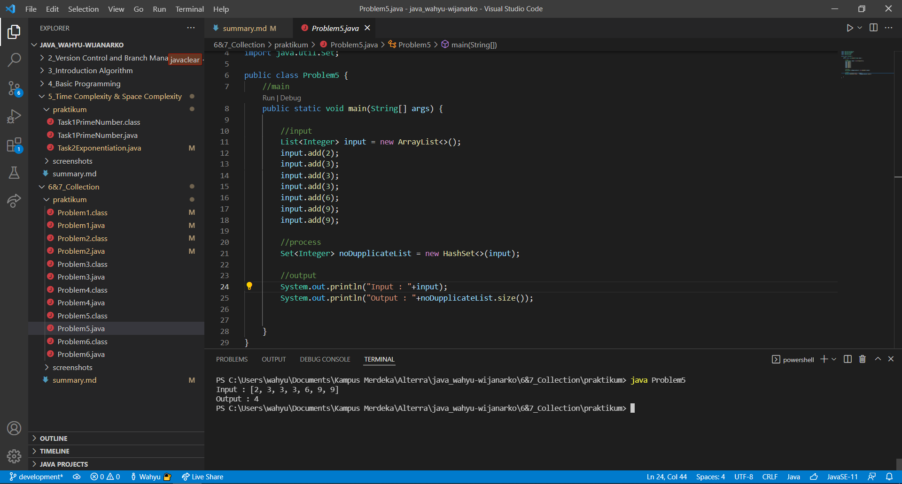
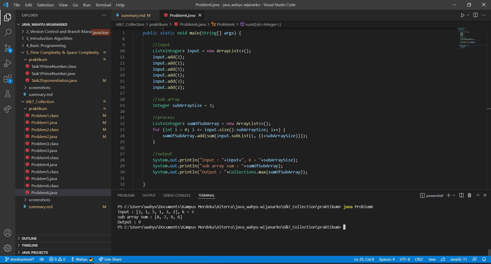

# (6&7) Collection
## Resume

Pembelajaran pada materi ini meliputi:  
1. Java Iterable
2. Java Collection
3. Set
4. List
5. Stack
6. Queue

##### Iterable
adalah interface perulangan.

###### Iterator
adalah kelas yang mengatur Iterable. 

##### Collections
adalah grup dari objek individual yang direpresentasikan pada unit tunggal yang dikenal sebagai Collection objek.

###### List
adalah interface yang memberikan cara untuk menyimpan koleksi terurut.  
Macam - macam List pada Java:
- AbstractList
- ArrayList
- AbstractSequentialList
- LinkedList

##### Stack
adalah tumpukan yang merepresentasikan LIFO (Last-In-First-Out). Operasinya adalah push dan pop.

##### Set
adalah List yang elemennya tidak ada data yang bernilai sama.  
Beberapa contoh Set:
- Set
- HashSet
- LinkedHashSet
- EnumSet
- SortedSet
- TreeSet
- NavigableSet

##### Queue
bisa diartikan sebagai antrian dimana sebuah operasi pengisian bisa dilakukan pada akhir yang disebut REAR, dan penghapusan bisa dilakukan pada akhir yang lain atau FRONT.

## Task
#### 1. ArrayMerge
Membuat program yang dapat menggabungkan 2 array dan tidak terdapat nilai yang sama.  
Code :  
[Problem1.java](./praktikum/Problem1.java)  
  
Screenshot :

#### 2. Angka Muncul Sekali
Diberikan sebuah String yang berisi kumpulan angka. Membuat sebuah program yang dapat menampilkan angka yang hanya muncul sekali.  
Code :  
[Problem2.java](./praktikum/Problem2.java)
  
Screenshot :  

#### 3. Pair with Target Sum
Diberikan sebuah array berisi angka dan nilai target. Membuat sebuah program yang dapat menampilkan 2 index array yang elemen pada index tersebut jika dijumlahkan nilainya adalah target yang diberikan.  
Code :  
[Problem3.java](./praktikum/Problem3.java)
  
Screenshot :

#### 4. Array Unique
Diberikan 2 array berisi angka. Membuat program yang dapat menampilkan array kumpulan angka yang berisi pada array pertama tetapi tidak di array kedua.  
Code :  
[Problem4.java](./praktikum/Problem4.java)
  
Screenshot :  

#### 5. Remove Dupplicates
Diberikan sebuah array berisi nilai. Membuat program yang dapat menampilkan array tanpa angka berulang dari nilai pertama.  
Code :  
[Problem5.java](./praktikum/Problem5.java)
  
Screenshot :  

#### 6. Maximum Sum Subarray of Size K
Diberikan sebuah array berisi angka dan jumlah subarray. Membuat program yang dapat menampilkan jumlah sub array tertinggi.  
Code :  
[Problem6.java](./praktikum/Problem6.java)
  
Screenshot :  
