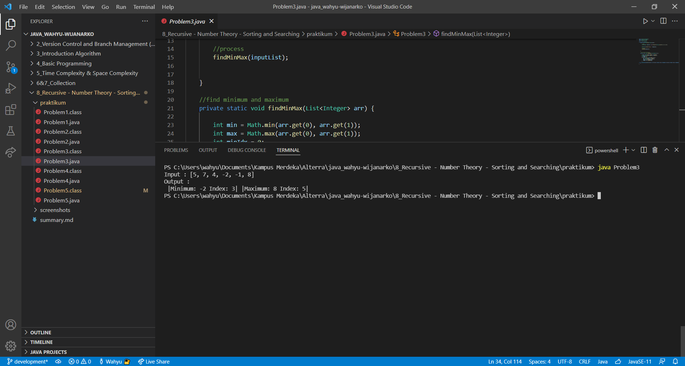

# (8) Recursive - Number Theory - Sorting and Searching
## Resume

Pembelajaran pada materi ini meliputi:
1. Recursive
2. Number Theory
3. Searching
4. Sorting

#### Recursive
adalah kondisi dimana fungsi menyelesaikan masalah dengan dengan memanggil dirinya sendiri.  
Recursive dipakai karena dapat menyelesaikan masalah dengan baris kode yang lebih sedikit.

#### Number Theory
adalah cabang matematika yang mempelajari bilangan. Beberapa contoh teori bilangan adalah bilangan prima, bilangan fibonacci, faktorial dan lain-lain.

#### Searching
adalah sebuah proses pencarian nilai dari kumpulan nilai.

#### Sorting
adalah proses pengurutan kumpulan nilai dari kecil terbesar atau sebaliknya.

## Task
#### 1. Prima ke X
Diberikan sebuah input bilangan. Mencari bilangan prima ke x, x adalah input bilangan yang diberikan.  
Code :  
[Problem1.java](./praktikum/Problem1.java)  
  
Screenshot hasil :  

#### 2. Fibonacci (Recursive)
Menggunakan fungsi recursive, mencari bilangan fibonacci ke-n dengan n adalah input bilangan.  
Code :  
[Problem2.java](./praktikum/Problem2.java)
  
Screenshot hasil :  

#### 3. Find Min and Max Number
Diberikan sebuah list berisi angka. Membuat program yang dapat menampilkan bilangan terendah dan indexnya, bilangan tertinggi dan indexnya.  
Code :  
[Problem3.java](./praktikum/Problem3.java)
  
Screenshot hasil :  

#### 4. Maximum Buy Product
Diberikan inputan berupa jumlah uang dan list harga barang. Membuat program yang dapat menghitung berapa banyak barang yang dapat dibeli dengan jumlah uang yang diinputkan.  
Code :  
[Problem4.java](./praktikum/Problem4.java)
  
Screenshot hasil :  

#### 5. Most Appear Item
Diberikan list. Membuat program yang dapat menampilkan jumlah elemen yang sama dari list secara berurutan dari kecil ke besar.  
Code :  
[Problem5.java](./praktikum/Problem5.java)
  
Screenshot hasil :  
