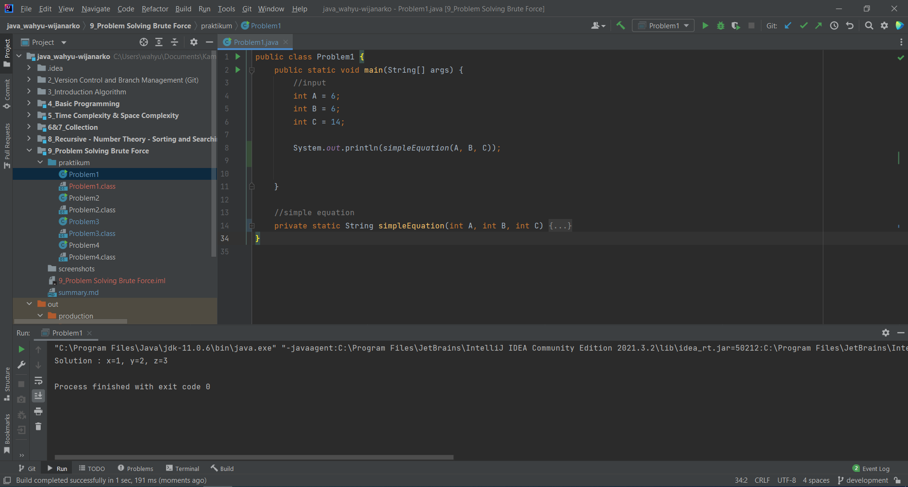
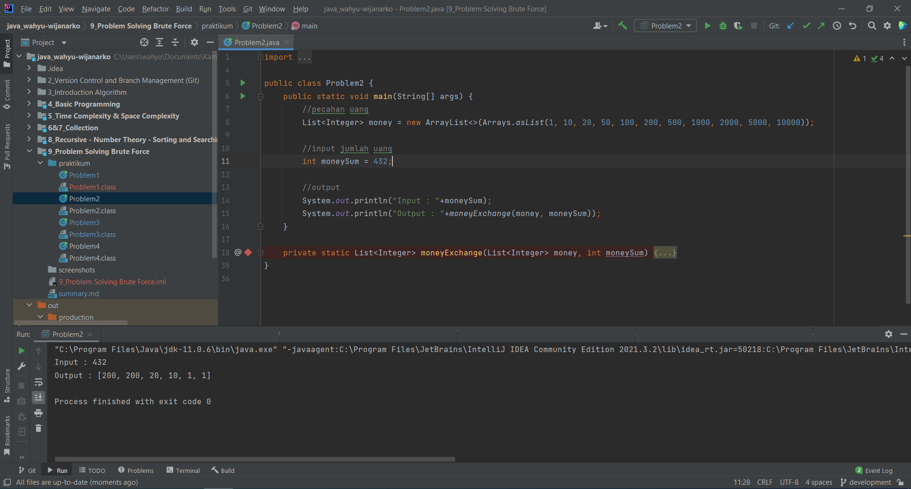
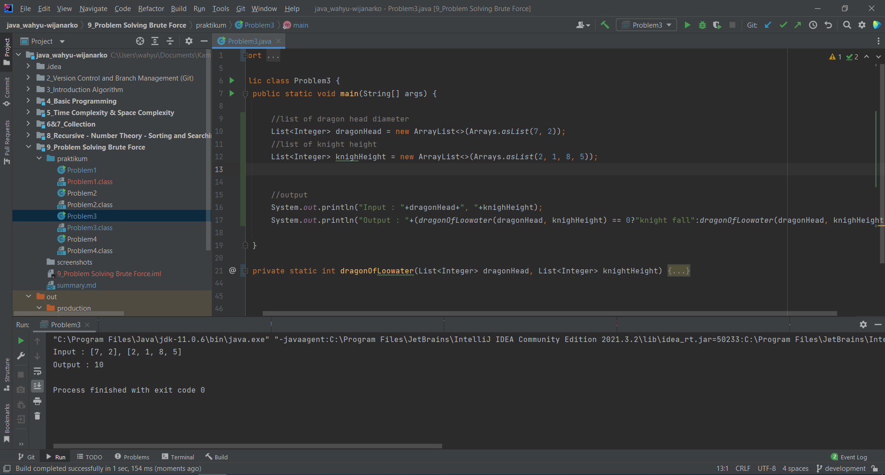
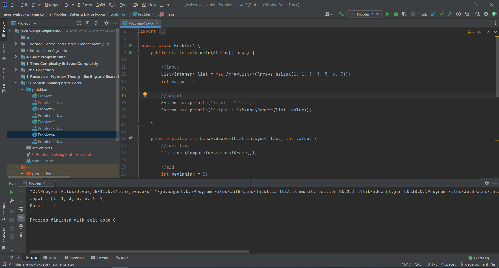

# (9) Problem Solving Brute Force
## Summary

Materi yang dipelajari pada section ini meliputi:
1. Problem Solving
2. Brute Force
3. Greedy
4. Divide and Conquer

#### Problem Solving
adalah pendekatan yang dilakukan untuk menyelesaikan suatu masalah.

#### Brute Force
Complete Search, Sequential Search merupakan istilah lain dari brute force. Penyelesaian masalahnya adalah dengan melakukan pengecekan secara berurut dari awal hingga akhir.

#### Greedy
Penyelesaian masalahnya adalah ketika sudah menemukan solusi maka ambil solusi tersebut.

#### Divide and Conquer
Penyelesaian masalahnya dengan membagi-bagi masalah menjadi lebih kecil lalu mencari solusi dari bagian - bagian kecil tersebut.

## Task
#### 1. Simple Equation
Diberikan inputan bilangan A, B, C. Dengan sebuah relasi perhitungan dengan :  
x+y+z = A  
xyz = B  
x^2+y^2+z^2 = C  
Buat program yang dapat mencari nilai x, y, z.  
  
Code:  
[Problem1.java](./praktikum/Problem1.java)  
  
Screenshot :  

#### 2. Money Change
Diberikan inputan berupa bilangan dan list uang. Membuat program yang dapat menampilkan jumlah uang yang diperlukan untuk mendapat nilai input bilangan.  
  
Code :  
[Problem2.java](./praktikum/Problem2.java)
  
Screenshot :    

#### 3. Dragon of Loowater
Diberikan inputan berupa list diameter kepala naga dan list tinggi prajurit. Buat program yang dapat menampilkan total minimum tinggi prajurit untuk mengalakan naga.
  
Code :  
[Problem3.java](./praktikum/Problem3.java)
  
Screenshot :  

#### 4. Binary Search Algorithm
Diberikan sebuah list bilangan. Membuat program yang dapat melakukan searching dengan algoritma binary search.
  
Code :  
[Problem4.java](./praktikum/Problem4.java)
  
Screenshot :  

